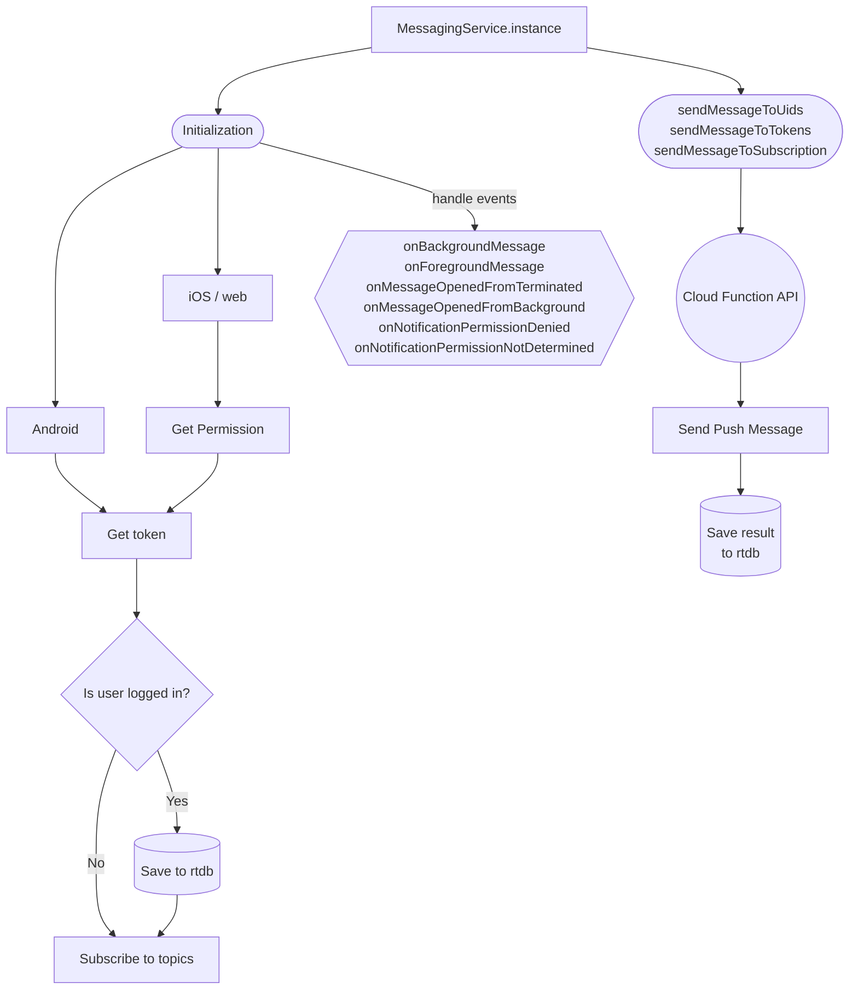
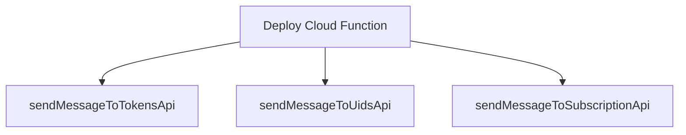

# Easy messaging

- The `easy_messaging` provides an easy way of handling the Firebase Cloud Messaging service.
- Supports topic subscriptions.

## Overview

- To send push notification to a device token from Flutter, the `access token` for HTTP API v1 is required. There is no way to get one securely.

  - It is state in the official document - [Update authorization of send requests](https://firebase.google.com/docs/cloud-messaging/migrate-v1#update-authorization-of-send-requests): `HTTP v1 messages must be sent through a trusted environment such as your app server or Cloud Functions for Firebase using the HTTP protocol or the Admin SDK to build message requests. Sending directly from client app logic carries extreme security risk and is not supported.`
  - Using the service account to get the access token for HTTP API v1 is very insecure and not recommended.
  - For this reason, to send push notifications, we use `easy_engine` and cloud functions. See the installation.

- It is stated in the official document - [Topic messaging on Flutter](https://firebase.google.com/docs/cloud-messaging/flutter/topic-messaging): `One app instance can be subscribed to no more than 2000 topic`.
  - So, this package supports topic subscription.

## Install

### Security rules Realtime Database

```json
    "fcm-tokens": {
      ".read": true,
      "$token": {
        ".write": "newData.val() === auth.uid",
      },
      ".indexOn": [".value"],
    },
    "fcm-subscriptions": {
      ".read": true,
      "$subscriptionId": {
        "$uid": {
          ".write": "$uid === auth.uid"
        }
      }
    },
```

## Logic

- `fcm tokens` are saved under `fcm-tokens/{uid}` in realtime database.

- `Save` the tokens in the `realtime database` only when the user `signs in`.
- `Subscribe` to `all` and `android,ios,fuchsia,linux,windows,macos` device platform topics even the user is not signed in.
- When the user signs out, and signs in another user, the same token will be saved into the another user.





## How to get the tokens of multiple users

- You can get the tokens of the users by passing the uid of them.

```dart
MessagingService.instance.getTokens([
  'vysiFTQS1ZXSnvS3UnxfeJEpCWN2',
  'Jkihj9GMRoNeZ1WXQ5FHMOr3E4c2',
]);
```

## Initialization

- Init the messaging service, and the required parameters.
- This will automatically subscribe to related platform topics base on device platform.

- Default topics

  - allUsersTopic
  - androidTopic
  - iosTopic
  - fuchsiaTopic
  - linuxTopic
  - windowsTopic
  - macosTopic

- This will subscribe to two topic, first is the platform specific topic (base on the user device platform) and the second is the all topic `allUsersTopic`.

- We also need to set the `sendMessageToTokensApi`, `sendMessageToUidsApi` and `sendMessageToSubscriptionApi` which we can get after we deploy the firebase cloud function from [easy-engine repo](https://github.com/thruthesky/easy-engine)

- To handle push notification we can use the following callback `onMessageOpenedFromBackground`,`onMessageOpenedFromTerminated` and `onForegroundMessage`.

```dart
   MessagingService.instance.init(
     sendMessageToTokensApi: 'https://sendmessagetotokens-<XXXXXXX-XX>.a.run.app',
     sendMessageToUidsApi: 'https://sendmessagetouids-<XXXXXXX-XX>.a.run.app',
     sendMessageToSubscriptionsApi:
         'https://sendmessagetosubscription-<XXXXXXX-XX>.a.run.app',
     onMessageOpenedFromBackground: (message) {
       WidgetsBinding.instance.addPostFrameCallback((duration) async {
         dog('onMessageOpenedFromBackground: $message');
         handleRemoteMessage(message);
       });
     },
     onMessageOpenedFromTerminated: (RemoteMessage message) {
       WidgetsBinding.instance.addPostFrameCallback((duration) async {
         dog('onMessageOpenedFromTerminated: $message');
         handleRemoteMessage(message);
       });
     },
     onForegroundMessage: (message) {
       dog('onForegroundMessage: $message');
     },
   );
```

# Android Head-up Notification

- Showing head-up notification on android need extra code to implement.
- The following code uses `flutter_local_notifications` package to handle the creation of the notification channel.

```dart
    /// Android Head-up Notification
    if (isAndroid) {
      /// Set a channel for high importance notifications.
      const AndroidNotificationChannel channel = AndroidNotificationChannel(
        'high_importance_channel', // id
        'High Importance Notifications', // title
        description: 'This channel is used for important notifications.', //
        importance: Importance.max, // max 로 해야 Head-up display 가 잘 된다.
        showBadge: true,
        enableVibration: true,
        playSound: true,
      );

      /// Register the channel with the system.
      /// If there is already a registed channel (with same id), then it will be re-registered.
      final FlutterLocalNotificationsPlugin flutterLocalNotificationsPlugin =
          FlutterLocalNotificationsPlugin();

      await flutterLocalNotificationsPlugin
          .resolvePlatformSpecificImplementation<
              AndroidFlutterLocalNotificationsPlugin>()
          ?.createNotificationChannel(channel);
    }
```

## Sending push notification

- To send push notification you can use the following `sendMessage`, `sendMessageToUid`, and `sendMessageToSubscription` methods.

### Send push notification to tokens

- Send push notification to tokens by passing the list of tokens.

```dart
    MessagingService.instance.sendMessageToTokens(
      tokens: ['token1', 'token2'],
      title: 'Sending via token',
      body: 'Push notification with tokens',
    );
```

### Send push notification to uids

- Send push notification to uids by passing the list of uids.

```dart
    MessagingService.instance.sendMessageToUids(
      uids: ['uid1', 'uid2'],
      title: 'Sending via uids',
      body: 'Push notification with uids',
    );
```

#### Excluded Subscribers

- Send push notification to the list of uids and exclude the uid if the uid subscribe to same subscriptionName.
- Usage: ( Blocking push notification on ChatRoom message create.)

```dart
    MessagingService.instance.sendMessageToUids(
      uids: uids,
      subscriptionName: room.id,
      excludeSubscribers: true,
      title: 'ChatService ${DateTime.now()}',
      body: '${message.text} ${room.id} ${message.id} ',
      data: {"action": 'chat', 'roomId': room.id},
    );
```

### Send push notification to subscriptions

- Send push notification to subscriptions by passing the list of subscriptions.

```dart
    MessagingService.instance.sendMessageToSubscription(
      subscription: 'subscription1'
      title: 'Sending via subscription',
      body: 'Push notification to subscription',,
    );
```

### Send push notification with additional data

- Send title and body may not be enough to handle push notification.
- You can add additional data, this can be use to all 3 sending options.
- You can attach addition information to handle what to do when you receive the push notification.
- The following example has action `post` which we can treat that the notification is related to post,
  so when we receive the push notification we can open the postview screen. and to do that we also need to past the `postId` so we can handle the message properly.

```dart
    MessagingService.instance.sendMessageToUids(
      uids: ['uid1', 'uid2'],
      title: 'Sending via uids with data',
      body: 'Contains additional data information',
      data: {
        "action": 'post',
        'postId': post.id,
      },
    );
```
