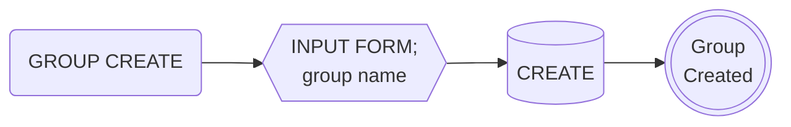
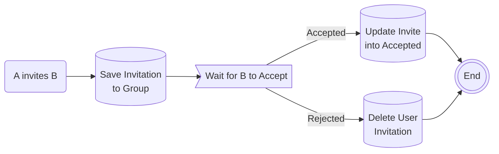
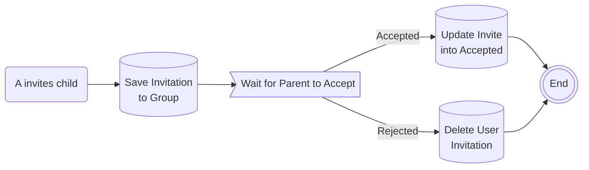
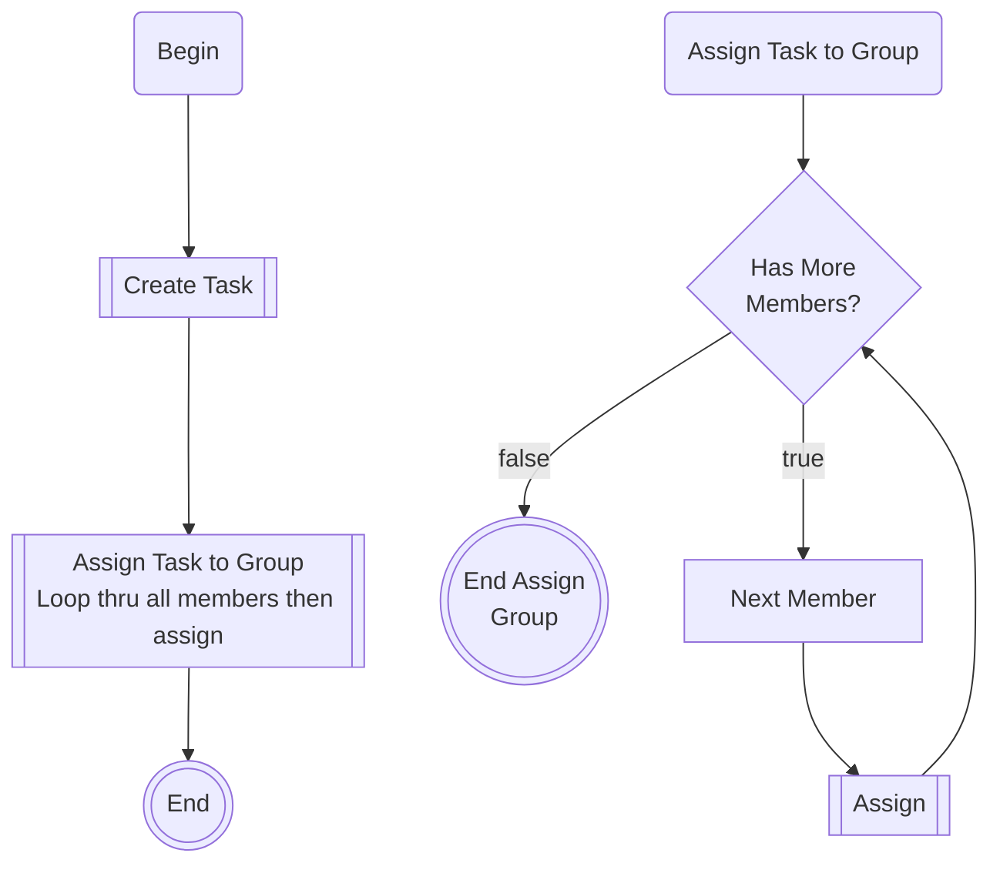
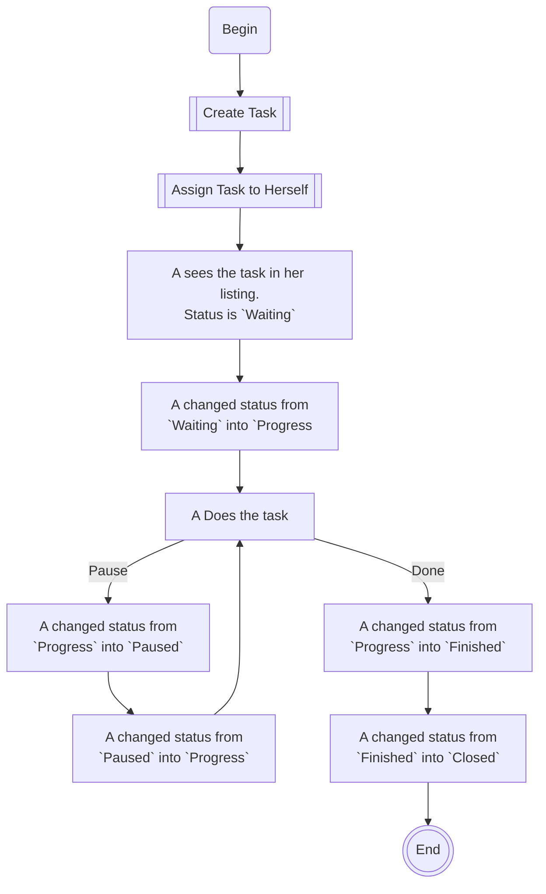

# Easy Task


This package is a todo like task manage system which allows a user to create groups, user lists, tasks and assign the task to the users of the group, and moderating the workflow.


## Logic

- `Sign-in` is required before using any of the widget or logic of the package. This package does not provide anything for user authentication. You can develop your own.
- User collection must be set on the `TaskService.instance.init( user: { collection: 'users', displayName: 'name', photoUrl:'photoURL', } )`.
  - The document id of the user collection must be the uid.
  - And by default, this package uses `dispalyName` in the document to get the user's name to display on the screen. And `photoUrl` to get the user's photoUrl. If your document uses different fields, you can set it on initialization.
  - For user search screen(or dislog), it will use the display name in user documents.


## Coding convention


### Documenations

#### Mermaid

- Starting must be `START(xxxx)`
- End must be `END(())`
- End with options should be `BUTTONS>Many options]`. For instance, after create a post, the app will show post deatil screen where the user can choose many options. And the process is finished when the post is created, then use this.
- Process must be `WORK[xxxx]`
- Create, Save, Update, Delete, or anything that need Database work must be `SAVE[(CREATE|UPDATE|DELETE)]`
- Subroutines, or the next screen, dialog should be displayed with `NEXT_SCREEN[[List screen xxx]]`.


### Model class

Model class does
- serialization/deserialization
- basic crud of the model data
- helper functions of the entity itself. Not other entities of the same model.
- encapsulating the refs.

Service class does
- something that are related with the model(entity) or the service can handle for the whole function(feacher).
- showing screens
- search & listing data
- initialization, listening, etc.


### Data listing

Use `FirestoreQueryBuilder` or `FirebaseDatabaseQueryBuilder`. Use query builder all the time.


## Documentation

There is no english version of documents. So, write all the document in the source code. The comment int source code will turn into dartdoc when it is deployed into pub.dev.


## Test


### Unit test

Do the unit test as Flutter does.

### Widget test


Do the widget test as Flutter does.


### House test


This is a special test for house only. This is because it's not easy to test while connection with Firebase.


## Translation

- initialize

```dart
void main() async {
  WidgetsFlutterBinding.ensureInitialized();
  TranslationService.instance.setDeviceLocale();
  runApp(const MyApp());
}
```

- t
```dart
Translation.instance.setLocale('ko');
'name'.t // 결과: 이름
```


- tr

```dart
final translationTexts = {
    'apple': {
        'en': {
            'zero': '{name} has no apple.',
            'one': '{name} has one apple.',
            'many': '{name} has {n} apples.',
        }
    }
};
```

Exmaple

```dart
TranslationService.instance.set(
  key: 'apple',
  locale: 'en',
  value: {
    'zero': '{name} has no apple.',
    'one': '{name} has one apple.',
    'many': '{name} has {n} apples.',
  },
);

int n = 0;
expect('apple'.tr(args: {'name': 'J'}, form: n), 'J has no apple.');
n = 1;
expect('apple'.tr(args: {'name': 'J'}, form: n), 'J has one apple.');
n = 3;
expect('apple'.tr(args: {'name': 'J', 'n': n}, form: n), 'J has 3 apples.');
```


## TODO feature


- A task can not be shared to multiple users. It's not sharing. It's like the same task is given to muliple user.
  - `Sharing task and working together is not supported, yet`.
  - When the creator creates a task, there will be only 1 copy of the task under `/todo-task`.

- The creator can assign the task to other user.
  - The list of assigns will be saved under `/todo-task-assign` subcollection.

- The relation of creator and assignee is N:M.


- flow of task.
```
creator -> assigned -> in-progress(working) -> [ finished | quit ] -> review -> [ accept | reject ]
```

- creator can schedule the task.

```
accept -> archive
```

```
reject -> [ask for enhance | failure | re-assign | delete]
```

```
failure -> [re-assign | achive | delete]
```


- status of task
```
[] -> [finished | quit] -> [accept | reject ]
```

- when the moderator accepts; properties: comment, score,
- when the moderator rejects; properties: comment, ... the task can be re-assigned to someone else.


'uid-1': { status: "", beginDate: "2024-07-04", endDate: "2024-08-01", comment: ".....", ......  }, 1M limit
status is is empty
date: is ongoing


///   'uid-2': {status: 'rejected', },
///   'uid-3': 'review',
///   'uid-4': 'ongoing',
///   'uid-5': 'done',


task1 { assigned: { .... }}
task2 { assigned: { .... }}
task3 { assigned: { .... : my-uid: finished }}
task4 { assigned: { .... }}
task5 { assigned: { .... }}
task6 { assigned: { .... }}
task7 { 
    task-aissgned /
        uid-1 { ... }
        uid-2 { ... }
        uid-3 { ... }
        uid-4 { ... }
}
/users/privte/"task-assigned"/ ... documents ...
/todo/people/works/tomorrow/"task_assgned"/ ... many documetns ...
...


## TODO feature


### TO DOs

There are more to improve. But these work will be done later.

- a moderator should be able to give permission to whom he can create tasks.
- A moderator can create his own user groups so he can quickly add all his member without inviting them indivisually in each groupo.


### Terms

- A `moderator` is the one who manages the tasks. Usually, the he is the one who creates the group, invites other users, creates tasks and assigns to others. Anyone can be a moderator without any registration.

- A `group` is a separate enity. It is managed by a `moderator`. It can have `members`. A moderator can assign task to a group.

### Logic of TODO feature

- A moderator should begin with creating a group to start managing tasks and users.




- Task can be created any member.


- Invite user and accept/reject



- Invite user (minor age)



- Assign Task to Group (Main)



- User B Does the task assigned by User A


- User A Created his own task for herself



### Todo database

### Todo-Task collection

- `uid` is the creator.
- `assignedTo` is a list of uids that the task was aissgend to. This will help on getting the user list of the task.

- `updatedAt` is updated when there is any changes on the task itself. Not the chagnes of other entitles like asignees.

### Todo-assign collection

- `status` is the status of the task.
  - The `status` can be chagned by the creator or assignee.
  - It can be one of;
    - `waiting` - meaning, the task is created but no activity yet. the task is assigned and the aissgnee hasn't done anyting yet.
    - `progress` - the task is in the middle of work.
    - `finished` - The task is finished. The app should notify the moderators(creators)
    - `review` - the work is in review. asking, the moderator to review it.
    - `closed` - the moderator can only mark it as `closed`. If the task is in `closed` status, assignee cannot update(change) anyting including the status anymore.
  - For example, The status can be changed at any time. Assignee can mark it as `review` and the moderator can mark it as `progress` soon after. But the moderator is the only one who can mark it as `closed` and once it is closed, it cannot be updated(changed).

### Widgets of TODO

#### TodoListView

This list view is responsible to list all kinds of tasks which includes but not limited to, listing;
  - tasks that are created by himself,
  - tasks that assign to himself, 
  - task that are create by himself and assigned himself,
  - task that are create by himself and assigned to others,
  - task that are create by himself and not assigned to any one,
  - task that are create by himself and assigned to more than 2 others,
  - and more more options.
