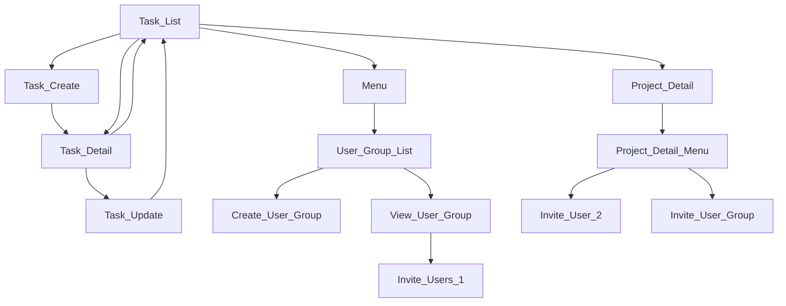

# Easy Task

This package is a todo like task manage system which allows users to create tasks and groups.

# Terms

- `Root level tasks`: These are tasks that do not belong to any projects. They are used by the logged-in user when they want to keep tasks for themselves only. Not sharing with others.

# Installation

## Firestore Indexes

- `tasks` collection composit indexes
  - `creator: asc` and `createdAt: desc` is required.
  - `project: asc` and `createdAt: desc` is required.
  - `parent: asc` and `createdAt: desc` is required.
  - `completed: asc` and `createdAt: desc` is required.
  - `child: asc` and `createdAt: desc` is requierd.

# Database Strucuture

## Task document

- `tasks` is the collection. All the tasks (work items) goes in this collection.

- See the comment of the [Task model class](https://pub.dev/documentation/easy_task/latest/easy_task/Task-class.html) that has more details of each fields.

# Logic

- Any body can create a task.
- 
- A task can be
  - a task or 
  - a project.
    - When a task is being created, the user can choose it to be a project.
    - A task can be turned into a task.
    - But a porject can not be turned into a task.

- A task may be (or may not be) assigned to a project.

- Task that is not assigned to a project is called `root level task`.

- `Sign-in` is required before using or accessing the task management system.
  - Anonymous login is okay.
  - This package does not provide anything for user authentication. You can develop your own.
  - See `phone_sign_in` package for sign-in that is built by the same developer of this package.

- `Task` is a work that can be managed and tracked.
  - It has priority. (NOT SUPPORTED, YET)
  - It may have due date. (NOT SUPPORTED, YET)
    - If the due date passes of an incomplete task, the task is highlighted and the tasks will be listed in `Over due` menu.
  - But it does not have any repeat.
    - It may have 'auto generate task every day/week/month/year' feature in the feature, but the task must not repeat.

- Each task has fields like below;
  - `project: bool` to know if it's a project or a task.
  - `child: bool` to know if it has a parent or not. If it's true, it belong to a project.

- `Project` is a task with a special purpose. It has `project: true`, while task has `project: false`. Think about it as a comment thread, `A task can have children tasks`. And the task that has children is called `Project`.
  - The `Project` information is saved as a task document, for the management purpose. So, in the list view, it will be listed together with otehr tasks.
  - Project can have many child tasks. Remember, Projects and tasks are saved in same `tasks` collection.

- A task can be assigned to other user (NOT supported, yet)

- A task can be moved to a project, and vice versa.

- In the list view, children tasks with `child: true` are not dispolayed.

- `Group task` is displayed together with other tasks in the same task list view.
  - Group task has no check box.
  - When the gropu task is clicked, it will display the details of it.

- User invitation is done by `easyuser`.
- Comment under each task is used by `easy_comment` package.

# Widgets

## Task List Screen

- `TaskService.instance.showTaskListScreen`: Call this method to show the tasks of the user. This method will show `TaskListScreen`. For custom design, simply copy the `TaskListScreen` and edit it on your own.

## TaskCount

Displaying number of tasks

- By default, it will display all the tasks under task collection including parent and child tasks, and projects.
- The params below can be combined
  - `all`: If this is set to true, it will only display no of tasks including parent and child tasks. Actually, all the document under the tasks will be returned.
  - `child`: If this is set to true, it will only display the no of child.
  - `project`: If this is set to true, it will display the no of project only. If it is false, only the no of tasks that are not project will be displayed.
  - `completed`: if this is true, only the no of completed tasks are displayed. If it is false, then it will display the no of `not completed` number.
  - `rootLevelTasks`: It displays the no of the root level tasks. It is simpley the combination of `project`: false and `child`: false.

# Custom UI Design

To do custom UI design, you need to understand how easy_task works.

# Known Issues

