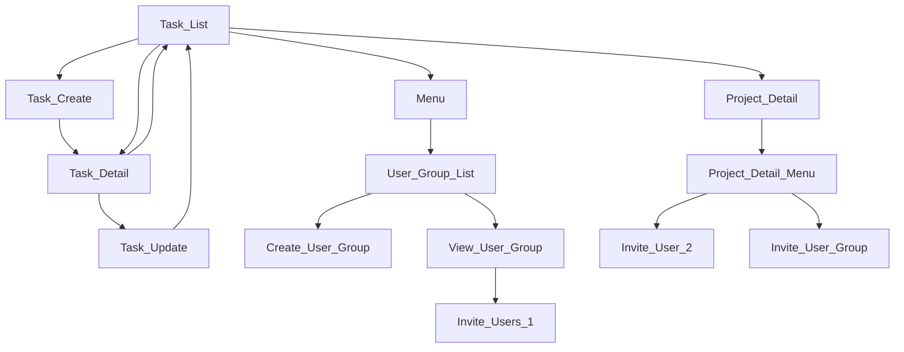

# Easy Task

This package is a todo like task manage system which allows a user to create groups, user lists, tasks and assign the task to the users of the group, and moderating the workflow.

# ai

저는 해야 할 일을 관리하는 앱을 만들고 싶습니다. 플러터와 파이어베이스의 파이어스토어 데이터베이스로 만들려고 합니다.
해야 할 일은 task 라고 부르며, task 의 데이터 모델 이름은 Task 클래스입니다. 이 Task 클래스는 파이어스토어 문서의 task 필드 정보를 가지고 있으며, 기본적인 task 생성, 수정, 삭제 등을 담당합니다.
아래에서 TaskService 클래스는 해야 할 일 시스템을 전반적으로 관리하고 도와주는 역할을 합니다.

사용자 로그인은 FirebaseAuth 를 통해서 관리하며, TaskService.instance.currentUser 가 로그인을 한 사용자의 FirebaseAuth User 값을 가지고 있습니다. 앱에서 사용자는 로그인을 이미 한 것으로 가정하고 개발을 합니다.

아래의 소스 코드에서 TaskCreateScreen 위젯은 task 를 생성하는 스크린입니다.

아래의 소스 코드에서 TaskDetailScreen 에서 생성된 task 의 정보를 보여줍니다. TaskDetailScreen 에서는 task 를 생성한 사용자 ID 와  제목, 내용, 생성된 날짜, 수정된 날짜 등을 보여주고 있습니다.

TaskUpdateScreen 에서는 task 를 수정하는 제목, 내용 입력 박스를 보여주고, 업데이트 버튼을 통해서 task 업데이트를 합니다.

TaskListScreen 에 FirestoreListView 를 통해서 로그인한 사용자가 작성한 task 목록을 보여주고 있습니다. 각 task 목록의 왼쪽에 체크 박스를 보여주고, 사용자가 체크 박스를 선택하면, Firestore 의 task 문서의 complete 필드에 true 값을 저장하고 싶습니다. 코드를 완성해 주세요.

# Test

## Unit test

Do the unit test as Flutter does.

## Widget test

Do the widget test as Flutter does.

# Task Rules Overview

- Any body can be a moderator as long as his uid is set to the `moderatorUsers` in the group.
- Any body can create a task.
- A task may be (or may not be) assigned to a group.
- A moderator can create user groups
  - So, he can quickly add all the users of that group without inviting them indivisually.
  - Remember, any one can be an moderator. Meaning, any one can create his own user groups even if he does not have any group.
  - The users must accept invitate to be a member of the group.

- Anyone can assign to anyone as long as they are in the same group.

- One cannot assign a task to a user who is not in the same group even if it's moderator or a creator. Meaning,
  - a task can only be assigned to
    - the creator himself
    - anyone in the group

- Anyone can create a group.
  - Only the group creator or moderator can update the group itself.
  - Only creator or moderator can invite users to the group.
  - Anyonce in the group can create tasks. And the task automatically belongs to the group.

- One task can be assigned to multiple users

# Database Strucuture

## Task Database Structure

- `task` is the collection. All the work items goes in this collection.

- Anyone in the group can edit task even if it is not created by himself.

- `assignedUsers` is the list of users who are assigned to the task.
  - App can filter tasks by searching this field instead of searching the whole `task-assigned` collection.

- `title`
- `content`
- `createdAt`
- `updatedAt`
- `scheduledAt` - Not supported, yet. If the field has value (date time), then the task will be disabled until the schedule time.
- `deadlineAt` - Not supported, yet. If the field has value (date time), then the task is considered as closed if the deadlien has passed.
- `status` - It's the stauts of the task. It can be one of `open`, `closed`.
  - the default is `open`
  - If it's closed, no one can edit the task and all the assinees cannot do their job. Meaning the task is freezed and assignees are not allow to work on it.

- The review comments are not supported at this time. But if there must a review comments feature, then the comments must belong to a task.

# Logic

- `Sign-in` is required before using any of the widget or logic of the package. This package does not provide anything for user authentication. You can develop your own.
  - See `phone_sign_in` package for sign-in that is built by the same developer of this package.

- `Task` is a work.

- Each task has fields like below;
  - `project: bool` to know if it's a project or a task.
  - `child: bool` to know if it has a parent or not. If it's true, it belong to a project.

- `Project` is a task with a special purpose. It has `project: true`, while task has `project: false`. Think about it as a comment thread, `A task can have children tasks`. And the task that has children is called `Project`.
  - The `Project` information is saved as a task document, for the management purpose. So, in the list view, it will be listed together with otehr tasks.
  - Project can have many child tasks. Remember, Projects and tasks are saved in same `tasks` collection.

- A task can be assigned to other user (NOT supported, yet)

- A task can be moved to a project, and vice versa.

- In the list view, children tasks with `child: true` are not dispolayed.

- `Group task` is displayed together with other tasks in the same task list view.
  - Group task has no check box.
  - When the gropu task is clicked, it will display the details of it.

# Known Issues

