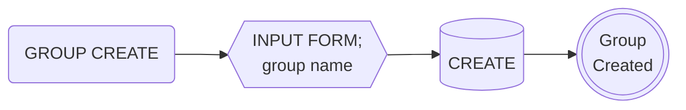
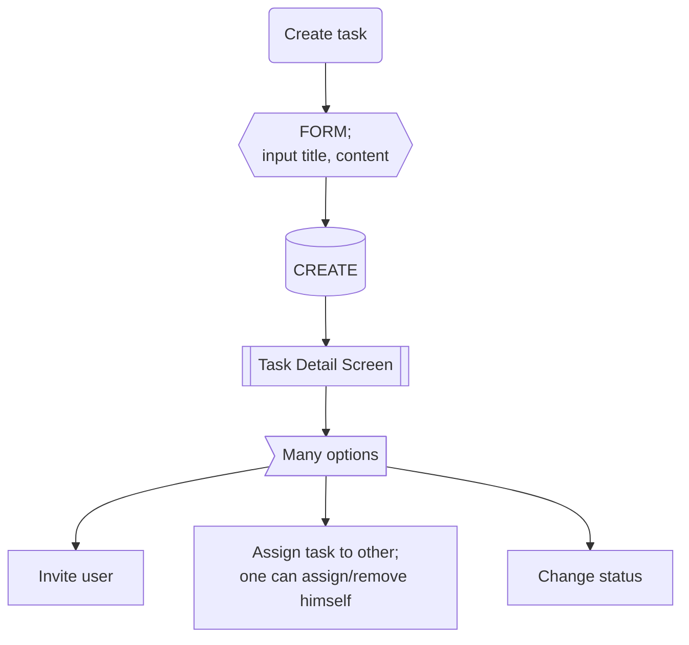
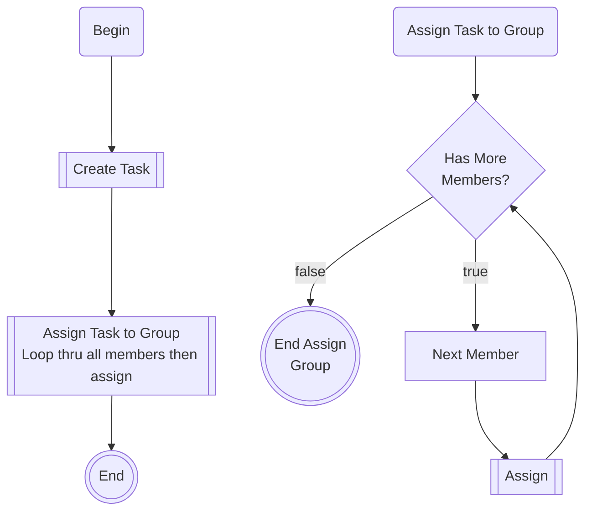
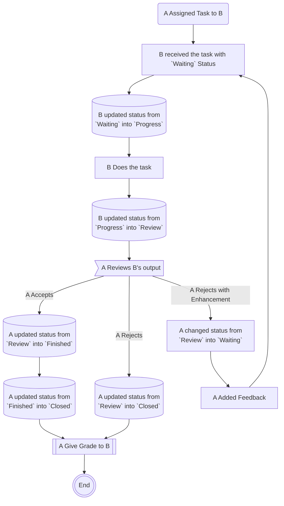
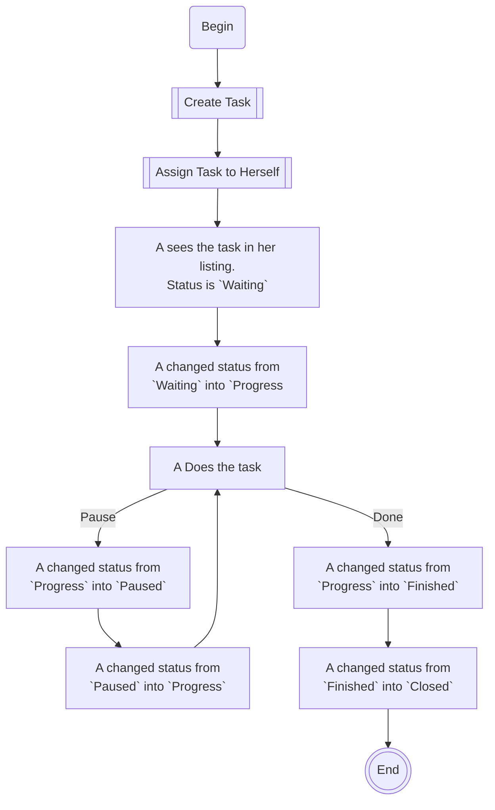

# Easy Task

This package is a todo like task manage system which allows a user to create groups, user lists, tasks and assign the task to the users of the group, and moderating the workflow.

## Logic

- `Sign-in` is required before using any of the widget or logic of the package. This package does not provide anything for user authentication. You can develop your own.
- User collection must be set on the `TaskService.instance.init( user: { collection: 'users', displayName: 'name', photoUrl:'photoURL', } )`.
  - The document id of the user collection must be the uid.
  - And by default, this package uses `displayName` in the document to get the user's name to display on the screen. And `photoUrl` to get the user's photoUrl. If your document uses different fields, you can set it on initialization.
  - For user search screen(or dislog), it will use the display name in user documents.

## Coding convention

### Documenations

#### Mermaid

- Starting must be `START(xxxx)`
- End must be `END(())`
- End with options should be `BUTTONS>Many options]`. For instance, after create a post, the app will show post deatil screen where the user can choose many options. And the process is finished when the post is created, then use this.
- Process must be `WORK[xxxx]`
- Create, Save, Update, Delete, or anything that need Database work must be `SAVE[(CREATE|UPDATE|DELETE)]`
- Subroutines, or the next screen, dialog should be displayed with `NEXT_SCREEN[[List screen xxx]]`.

### Model class

Model class does
- serialization/deserialization
- basic crud of the model data
- helper functions of the entity itself. Not other entities of the same model.
- encapsulating the refs.

Service class does
- something that are related with the model(entity) or the service can handle for the whole function(feacher).
- showing screens
- search & listing data
- initialization, listening, etc.

### Data listing

Use `FirestoreQueryBuilder` or `FirebaseDatabaseQueryBuilder`. Use query builder all the time.

## Documentation

There is no english version of documents. So, write all the document in the source code. The comment int source code will turn into dartdoc when it is deployed into pub.dev.

## Test

### Unit test

Do the unit test as Flutter does.

### Widget test

Do the widget test as Flutter does.

### House test

This is a special test for house only. This is because it's not easy to test while connection with Firebase.


## TODO feature

### TO DOs

There are more to improve. But these work will be done later.

- a moderator should be able to give permission to whom he can create tasks.
- A moderator can create his own user groups so he can quickly add all his member without inviting them indivisually in each group.

### Terms

- A `moderator` is the one who manages the tasks. Usually, the he is the one who creates the group, invites other users, creates tasks and assigns to others. Anyone can be a moderator without any registration.

- A `group` is a separate enity. It is managed by a `moderator`. It can have `members`. A moderator can assign task to a group.

### Logic of TODO feature

- A moderator should begin with creating a group to start managing tasks and users.



- Task can be created any member.



- Invite user and accept/reject


- Invite user (minor age)


- Assign Task to Group (Main)



- User B Does the task assigned by User A



- User A Created his own task for herself



### Firestore Database

These are the collections relating to easy_task:

- `task` is the collection for tasks.
- `task-assign` is the collleciton for assigns. It has `taskId` to relate to tasks.
- `task-user-group` is the collection for group.

#### task collection (Task)

- `uid` is the uid of creator.
- `assignedTo` is a list of uids that the task was assigned to. This will help on getting the user list of the task.
- `title` is the title of the task.
- `content` is the content of the task.
- `groupId` is the id of the group. Can be null if the task is not related to any group.
- `createdAt` is when it was created.
- `updatedAt` is updated when there is any changes on the task itself.

#### task-assign collection (Assign)

- `uid` is the uid of the assignee.
- `assignedBy` is the uid of the assignor.
- `taskId` is the id of the task.
- `status` is the status of the task.
  - The `status` can be chagned by the creator or assignee.
  - It can be one of;
    - `waiting` - meaning, the task is created but no activity yet. the task is assigned and the aissgnee hasn't done anyting yet.
    - `progress` - the task is in the middle of work.
    - `finished` - The task is finished. The app should notify the moderators(creators)
    - `review` - the work is in review. asking, the moderator to review it.
    - `closed` - the moderator can only mark it as `closed`. If the task is in `closed` status, assignee cannot update(change) anyting including the status anymore.
  - For example, The status can be changed at any time. Assignee can mark it as `review` and the moderator can mark it as `progress` soon after. But the moderator is the only one who can mark it as `closed` and once it is closed, it cannot be updated(changed).
- `groupId` is the id of the group. Can be null if the task is not related to any group.
- `createdAt` is when it was created.
- `updatedAt` is updated when there is any changes on the assign itself.
- `taskId` is the id of the task which the assign is related to.

#### task-user-group Collection (TaskUserGroup)

- `name` is the name of the group.
- `users` is the uids of the users under the group.
- `moderatorUsers` is the uids of the moderators of the group.
- `invitedUsers` is a list of users' uids who were invited by the moderator.
- `rejectedUsers` is a list of users' uids who rejected the invitation.
- `createdAt` is when it was created.
- `updatedAt` is updated when there is any changes on the group itself.

### Widgets of TODO

#### TodoListView

This list view is responsible to list all kinds of tasks which includes but not limited to, listing;
  - tasks that are created by himself,
  - tasks that assign to himself, 
  - task that are create by himself and assigned himself,
  - task that are create by himself and assigned to others,
  - task that are create by himself and not assigned to any one,
  - task that are create by himself and assigned to more than 2 others,
  - and more more options.

## Usage

These are the usage of how you code using easy_task package.

In easy task there are these entities:

- group
- assign
- task

### Creating a Group

To create a TaskUserGroup, you can check the example code below.

```dart
class TaskUserGroupDetailScreen extends StatefulWidget {
  const TaskUserGroupDetailScreen({super.key});

  @override
  State<TaskUserGroupDetailScreen> createState() => _TaskUserGroupDetailScreenState();
}

class _TaskUserGroupDetailScreenState extends State<TaskUserGroupDetailScreen> {
  final nameController = TextEditingController();

  @override
  void dispose() {
    nameController.dispose();
    super.dispose();
  }

  @override
  Widget build(BuildContext context) {
    return Scaffold(
      appBar: AppBar(
        title: const Text("Create Group"),
      ),
      body: Padding(
        padding: const EdgeInsets.all(24.0),
        child: Column(
          crossAxisAlignment: CrossAxisAlignment.stretch,
          children: [
            TextField(
              controller: nameController,
              decoration: const InputDecoration(
                labelText: "Group Name",
              ),
            ),
            const Spacer(),
            ElevatedButton(
              onPressed: () async {
                final groupRef = await Group.create(name: nameController.text);
                final group = await Group.get(groupRef.id);
                if (!context.mounted) return;
                Navigator.of(context).pop();
              },
              child: const Text("Create"),
            ),
            const SafeArea(
              child: SizedBox(
                height: 24,
              ),
            ),
          ],
        ),
      ),
    );
  }
}
```

To simplify, the code that creates a group is:

```dart
final groupRef = await TaskUserGroup.create(name: nameController.text);
```

`TaskUserGroup.create()` will automatically set the current user as the moderator of the group.

### Viewing the Group Details

To view the details of the group, check the code below.

```dart
// We need to get group from somewhere. Here we got it thru id.
final group = await TaskUserGroup.get(groupRef.id);
showGeneralDialog(
  context: context,
  pageBuilder: (context, a1, a2) {
    return TaskUserGroupDetailScreen(group: group!);
  },
);
```

However, for customization, you can code your own group detail screen.

### Inviting User in a group

In easy_task, invited users' uid will be included under invitedUsers field in TaskUserGroup. Check the code below.

```dart
IconButton(
  onPressed: () {
    showGeneralDialog(
      context: context,
      pageBuilder: (context, a1, a2) =>
          TaskUserGroupInvitationListScreen(
        group: widget.group,
        onInviteUids: (context) async {
          return await showGeneralDialog<List<String>?>(
            context: context,
            pageBuilder: (context, a1, a2) => Scaffold(
              appBar: AppBar(
                title: const Text("Invite Users"),
              ),
              body: UserListView(
                itemBuilder: (user, index) {
                  return UserListTile(
                    user: user,
                    onTap: () => {
                      Navigator.of(context).pop([user.uid]),
                    },
                  );
                },
              ),
            ),
          );
        },
      ),
    );
  },
  icon: const Icon(Icons.outbox),
),
```

It will depend on how you want to use invitation or how to choose who to invite (or get the uid of the user to invite).

### Listing Invitations

To list the invitations by the group, check the code below.

```dart
IconButton(
  onPressed: () {
    showGeneralDialog(
      context: context,
      pageBuilder: (context, a1, a2) => TaskUserGroupInvitationListScreen(
        group: widget.group,
      ),
    );
  },
  icon: const Icon(Icons.outbox),
),
```

The code above will show a default invitation list screen for group. However, for customization, you can code your own invitation list screen.

The code below will show a listing for group's invitation.

```dart
// We need to get group from somewhere. Here we got it thru id.
final group = await TaskUserGroup.get(groupRef.id);

// ...
// This is usually inside build method.
// ...
ListView.builder(
  itemCount: group.invitedUsers.length,
  itemBuilder: (context, index) => ListTile(
    title: Text(group.invitedUsers[index]),
  ),
),
```

To list the invitations received by the current user, check the code below.

```dart
class ReceivedInvitationScreen extends StatelessWidget {
  const ReceivedInvitationScreen({super.key});

  String? get myUid => FirebaseAuth.instance.currentUser?.uid;

  @override
  Widget build(BuildContext context) {
    return Scaffold(
      appBar: AppBar(
        title: const Text("Invitations"),
      ),
      body: TaskUserGroupListView(
        queryOptions: TaskUserGroupQueryOptions(
          invitedUsersContain: myUid!,
        ),
        itemBuilder: (group, index) {
          return ListTile(
            title: Text(group.name),
            trailing: Row(
              mainAxisSize: MainAxisSize.min,
              children: [
                ElevatedButton(
                  onPressed: () async {
                    await group.accept();
                    if (!context.mounted) return;
                    Navigator.of(context).pop();
                  },
                  child: const Text("Accept"),
                ),
                ElevatedButton(
                  onPressed: () {
                    group.reject();
                  },
                  child: const Text("Reject"),
                ),
              ],
            ),
          );
        },
      ),
    );
  }
}
```

In the code above, it is using `queryOptions: TaskUserGroupQueryOption(invitedUsersContain: myUid!)` to list the invitations received by the current user, using `TaskUserGroupListView` widget.

```dart
String? get myUid => FirebaseAuth.instance.currentUser?.uid;

// ...
TaskUserGroupListView(
  queryOptions: TaskUserGroupQueryOptions(
    invitedUsersContain: myUid!,
  ),
)
```

### Accepting/Rejecting a Group Invitation

To create an Accept/Reject buttons, check the code below.

```dart
// We need to get group from somewhere. Here we got it thru id.
final group = await TaskUserGroup.get(groupRef.id);

// ...
// Normally, this is being returned inside build method.
// ...
Row(
  mainAxisSize: MainAxisSize.min,
  children: [
    ElevatedButton(
      onPressed: () async {
        await group.accept();
        if (!context.mounted) return;
        Navigator.of(context).pop();
      },
      child: const Text("Accept"),
    ),
    ElevatedButton(
      onPressed: () {
        group.reject();
      },
      child: const Text("Reject"),
    ),
  ],
),
```

To accept a group, using `group.accept()` will accept the invitation and let the current user join the group.

To reject a group, using `group.reject()` will reject the invitation.


```dart
// accept
await group.accept();

// reject
await group.reject();
```

### Creating Task

To make a button that opens a Task Create Screen, use the code below.

```dart
ElevatedButton(
  onPressed: () {
    showGeneralDialog(
      context: context,
      pageBuilder: (context, a1, a2) {
        return const TaskCreateScreen();
      },
    );
  },
  child: const Text('+ Create A Task'),
),
```

The code above will use the easy_task's default task create screen. However, for customization, you can code your own task create screen.

```dart
ElevatedButton(
  onPressed: () {
    showGeneralDialog(
      context: context,
      pageBuilder: (context, a1, a2) {
        return const CustomTaskCreateScreen();
      },
    );
  },
  child: const Text('+ Create A Task'),
),
```

In your `CustomTaskCreateScreen`, what you can do is to add the create button that calls a function like the code below.

```dart
class _TaskCreateScreenState extends State<TaskCreateScreen>{
  final titleController = TextEditingController();
  final contentController = TextEditingController();
  // ...
  // add your field controllers as needed.
  // ...
  @override
  Widget build(BuildContext context) {
    return Scaffold(
      appBar: //...
      body: Column(
        children: [
          // ...
          // add your text fields as needed.
          // ...
          ElevatedButton(
            onPressed: createTask,
            child: const Text("Create Task"),
          ),
          // ...
        ],
      ),
    );
  }

  createTask() async {
    final createRef = await Task.create(
      title: titleController.text,
      content: contentController.text,
      groupId: widget.group?.id,
    );
    final task = await Task.get(createRef.id);
    if (!mounted) return;
    Navigator.of(context).pop();
    showGeneralDialog(
      context: context,
      pageBuilder: (_, __, ___) => TaskDetailScreen(
        task: task!,
      ),
    );
  }
}
```

### Viewing a Task

To view or to display the details of the task, use the code below.

```dart
// We need to get task from somewhere. Here we got it from snapshot.
final task = Task.fromSnapshot(snapshot.docs[index]);

// We can show the details of the task here.
showGeneralDialog(
  context: context,
  pageBuilder: (_, __, ___) => TaskDetailScreen(
    task: task,
  ),
);
```

The code above will use the easy_task's default TaskDetailScreen. However, for customization, you can code your own task detail screen.

### Listing Tasks

Create your task list screen using `TaskListView` widget. Check the code below.

```dart
class TaskListScreen extends StatelessWidget {
  const TaskListScreen({super.key});

  String? get myUid => FirebaseAuth.instance.currentUser?.uid;

  @override
  Widget build(BuildContext context) {
    return Scaffold(
      appBar: AppBar(
        title: const Text('Task Assigned to Me'),
      ),
      body: TaskListView(
        queryOptions: TaskQueryOptions(
          assignToContains: myUid!,
        ),
      ),
    );
  }
}
```

The `TaskListView` widget will use a default queryOptions that will list all the task if queryOptions is not provided. Automatically, the listing is ordered by `createdAt` field, descending.

The `TaskListView` widget uses it's own ListTile widget to display each task in list. Modify the widgets using the itemBuilder. Check the code below.

```dart
class TaskListScreen extends StatelessWidget {
  const TaskListScreen({super.key});

  String? get myUid => FirebaseAuth.instance.currentUser?.uid;

  @override
  Widget build(BuildContext context) {
    return Scaffold(
      appBar: AppBar(
        title: const Text('Task Assigned to Me'),
      ),
      body: TaskListView(
        queryOptions: TaskQueryOptions(
          assignToContains: myUid!,
        ),
        itemBuilder: (task, index) {
          // Replace this with your own list tile.
          return ListTile(
            title: Text(task.title),
          );
        },
      ),
    );
  }
}
```

### Assigning a Task (Creating Assign)

To assign a task, in easy_task, it means creating `assign` doc. As an example check the code below to see how to create assign button.

```dart
// Get task somewhere. Here we got it thru id.
final task = Task.get(taskId)

// ...
// Normally, this is being returned inside build method.
ElevatedButton(
  onPressed: () async {
    // Get the target user to be assigned somewhere.
    // This will depend on your user model.
    final user = User.get(uid);
    await Assign.create(
      uid: user.uid,
      taskId: task.id,
    );
  },
  child: const Text('ASSIGN +'),
),
```

The code above shows an example to assign a task to a user. However, we can also assign task to group as well.

```dart
// Get the group somewhere. Here we got it thru id.
final group = TaskUserGroup.get(groupId);

// ...
// Normally, this is being returned inside build method.
ElevatedButton(
  onPressed: () async {
    TaskService.instance.assignGroup(
      taskId: task.id,
      groupId: group!.id,
    );
  },
  child: const Text('ASSIGN +'),
),
```

As shown in code above, we can use `TaskService.instance.assignGroup()` to assign a task to a group.

### Viewing an Assign

To view or to display the details of the assign, use the code below.

```dart
// We need to get assign from somewhere. Here we got it from snapshot.
final assign = Assign.fromSnapshot(snapshot.docs[index]);

// We can show the details of the assign here.
showGeneralDialog(
  context: context,
  pageBuilder: (_, __, ___) => AssignDetailScreen(
    assign: assign,
  ),
);
```

The code above uses easy_task's default assign detail screen. However, for customization, you can code your own assign detail screen.

### Listing Assigns

In task, we can assign it to a user or to multiple users. In each task, we can have multiple assigns. Check the code below to see how we can code with assign listing.

```dart
// We need only the task ID. Here we got it from snapshot.
final task = Task.fromSnapshot(snapshot.docs[index]);

// ...
// This is usually inside build method.
// ...
AssignListView(
  queryOptions: AssignQueryOptions(
    taskId: task.id,
  ),
),
// ...
```

The code above will display the list of assign of the task. If `queryOptions` was not provided, it will use default `AssignQueryOptions` and list all assigns across all tasks.

### Status of an Assigned Task

Once the task is assigned, by default the status is `waiting`.

To change the status, check the code below.

```dart
// We need to get assign from somewhere. Here we got it thru id.
final assign = Assign.get(assignId);

await assign.changeStatus(AssignStatus.progress);
```

The code above will update the assign into `progress` status.
