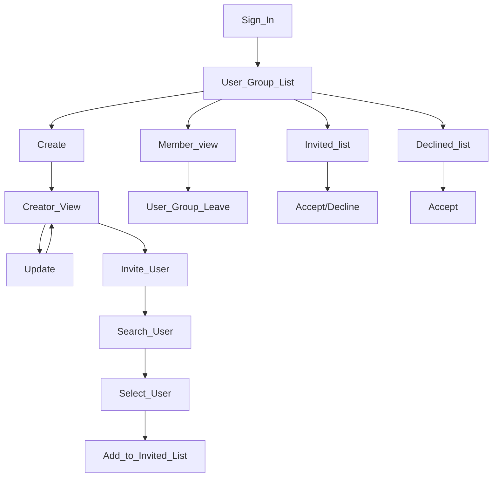

# Easy user group

This package helps to grouping users using Firestore.


- [Easy user group](#easy-user-group)
  - [Overview](#overview)
  - [Installation](#installation)
    - [Firestore Indexes](#firestore-indexes)
    - [Firestore Security Rules](#firestore-security-rules)
  - [Database structure](#database-structure)
    - [Fields](#fields)
  - [Developer's guideline](#developers-guideline)
  - [How to use](#how-to-use)
    - [invite user](#invite-user)
    - [re-invite](#re-invite)
    - [display the details](#display-the-details)




## Overview

- The user must sign-in first before using any of the user group functionality. Or it may throw exception.

## Installation

- Add the `easy_user_group` package as the dependency of your app.


### Firestore Indexes

- `user-groups` collection composit indexes
  - `	pendingUsers: Arrays` and `updatedAt: desc` is required.
  - `	users: Arrays` and `updatedAt: desc` is required.

### Firestore Security Rules

- Add the following in the Firestore security rules.

```ts
match /user-groups/{userGroupId} {

  function isMember() {
    return resource.data.keys().hasAll(['users'])
            && request.auth.uid in resource.data.users;
  }

  function willBeMember() {
    return request.auth.uid in request.resource.data.users;
  }

  function shouldBeMember() {
    return request.auth.uid in request.resource.data.users
  }

  function isPending() {
    return  resource.data.keys().hasAll(['pendingUsers'])
            && request.auth.uid in resource.data.pendingUsers;
  }

  function isDeclined() {
    return resource.data.keys().hasAny(['declinedUsers'])
      && request.auth.uid in resource.data.declinedUsers;
  }

  function willBeDeclinedUser() {
    return request.resource.data.keys().hasAny(['declinedUsers'])
            && request.auth.uid in request.resource.data.declinedUsers;
  }

  function willOnlyAddOneUser() {
    return resource.data.users.toSet().intersection(request.resource.data.users.toSet()) == resource.data.users.toSet()
      && request.resource.data.users.toSet().difference(resource.data.users.toSet()).size() == 1;
  }

  function willOnlyRemoveOneUser() {
    return request.resource.data.users.toSet().intersection(resource.data.users.toSet()) == request.resource.data.users.toSet()
            && resource.data.users.toSet().difference(request.resource.data.users.toSet()).size() == 1;
  }

  function isAccepting() {
    return !isMember()
    && willBeMember()
    && willOnlyAddOneUser()
    && onlyUpdating(['users', 'pendingUsers', 'updatedAt']);
  }

  function isDeclining() {
    return isPending()
            && willBeDeclinedUser()
            && onlyUpdating(['declinedUsers', 'pendingUsers', 'updatedAt']);
  }
  function isLeaving() {
    return !isMyDoc()
    && !willBeMember()
    && isMember()
    && willOnlyRemoveOneUser()
    && onlyUpdating(['users', 'updatedAt']);
  }


  allow read: if isMyDoc()
  || isMember()
  || isPending()
  || isDeclined();
  allow create: if willBeMyDoc()
  && willBeMember();
  allow update: if (isMyDoc() && shouldBeMember())
  || isAccepting()
  || isDeclining()
  || isLeaving();
  allow delete: if isMyDoc();
}
```


## Database structure

- It uses Firestore.

- `/user-group`: the user group collection
- `/user-group/<group-id>`: the document that has the group information.

### Fields

- `uid`: the user uid of the owner.
- `createdAt`: the date time of creation

- `updatedAt`: ..

- `users`: users who accepted.
- `pendingUsers`: who didn't decided for accept or rejection.
- `declinedUsers`: who rejected the invitation.

## Developer's guideline

- It uses `easyuser` for searching users.
- To see the whole example in action, call `UserGroupService.instance.showUserGroupListScreen()`.

## How to use

### invite user

- Invite a user

```dart
final user = await UserService.instance.showSearchDialog();
await UserGroup.invite(otherUid: user.uid);
```

- Remove a user from the user list

```dart
await UserGroup.remove(otherUid: 'uid');
```

### re-invite

- Use case:

  - If the user declined, the moderator can invite again.

- Re-invite a user
  - This remove the user from declined list and add to pending list.

```dart
await UserGroup.inviteAgain(otherUid: 'uid');
```

### display the details

- To display the details
  - The details screen display not only the user list of accepted, pending, declined.

```dart
UserGroupService.instance.showDetailScreen();
```

- This has a tab of accept, pending, declined list.
  - with appropriate menus;
