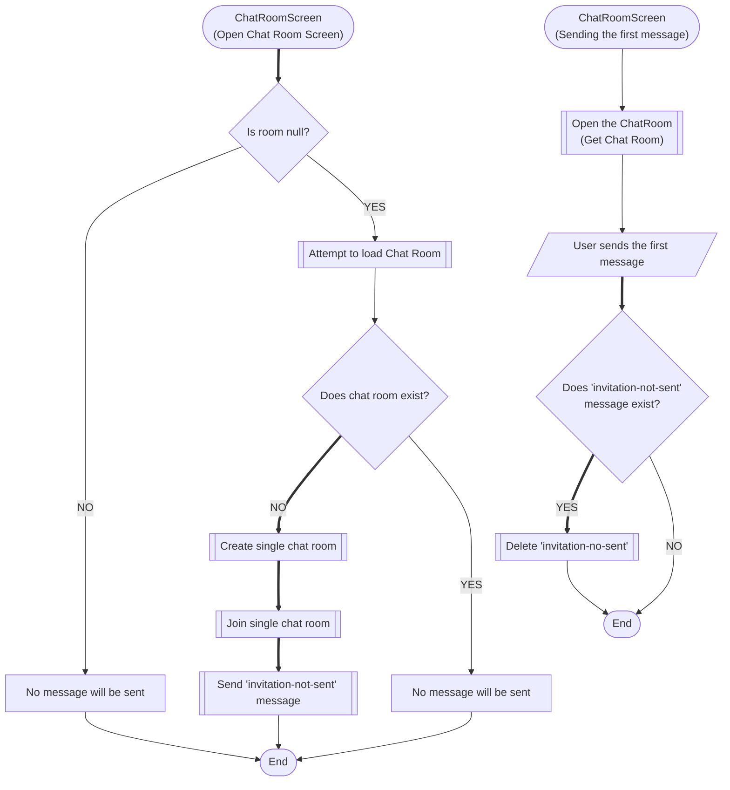
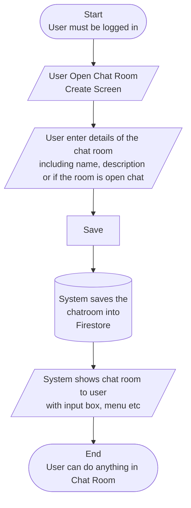
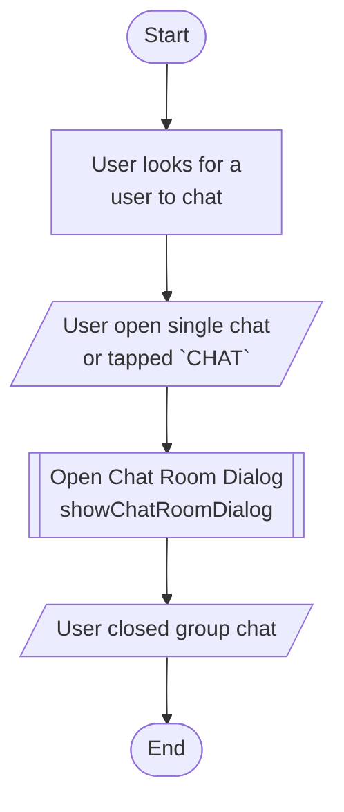
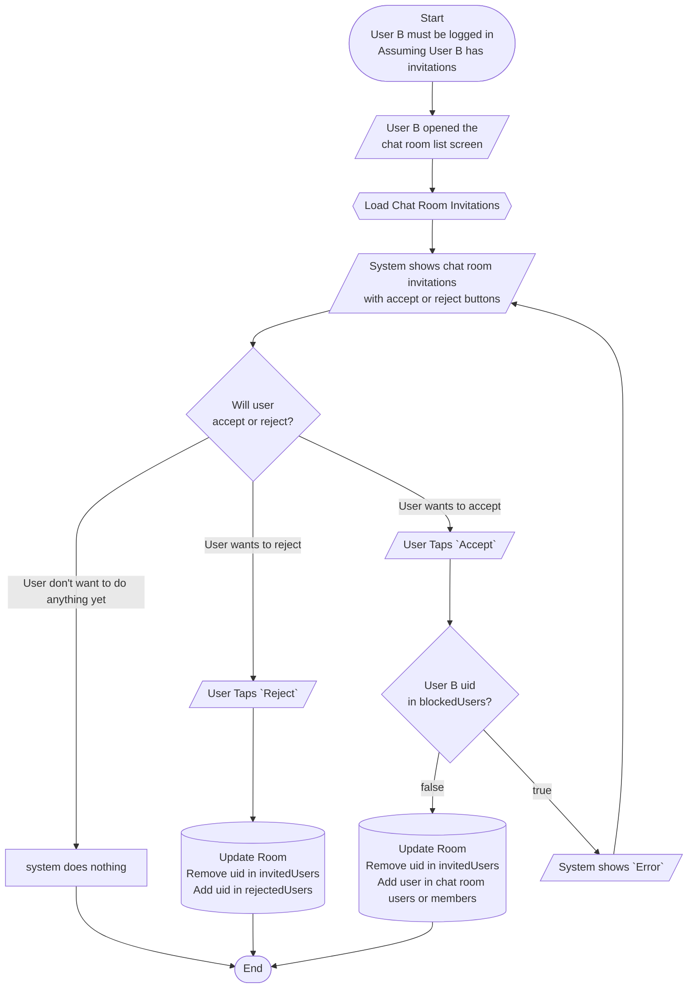
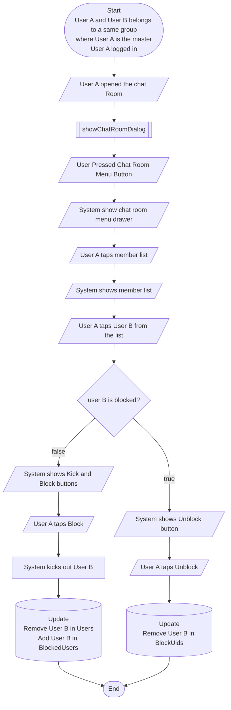

# EasyChat


This `easychat` package offers everything you need to build a chat app. With this package, you can easily add a full-featured, attractive chat function to your existing app.

- [EasyChat](#easychat)
- [Terms](#terms)
- [TODO](#todo)
- [Why Realtime Database](#why-realtime-database)
- [Installation](#installation)
  - [Secuirty rules](#secuirty-rules)
    - [Realtime Database Security Rules](#realtime-database-security-rules)
    - [Storage Rules](#storage-rules)
    - [Firestore Rules](#firestore-rules)
    - [Firestore Indexes](#firestore-indexes)
  - [Initialization](#initialization)
- [Dependencies](#dependencies)
- [Logics](#logics)
  - [Group chat room creation](#group-chat-room-creation)
  - [Protocol](#protocol)
  - [Chat invitation and delete invitation](#chat-invitation-and-delete-invitation)
  - [Chat message sending](#chat-message-sending)
  - [Ordering](#ordering)
  - [Counting the invitation](#counting-the-invitation)
  - [Number of New Messages Counting](#number-of-new-messages-counting)
  - [Chat join](#chat-join)
  - [Displaying chat messages and sending a message](#displaying-chat-messages-and-sending-a-message)
- [Database Strucutre](#database-strucutre)
  - [Chat room](#chat-room)
  - [Chat message](#chat-message)
  - [Chat join](#chat-join-1)
  - [Chat setting](#chat-setting)
    - [Saving unread number of messages.](#saving-unread-number-of-messages)
    - [Changing the chat room name](#changing-the-chat-room-name)
    - [Saving push notifications](#saving-push-notifications)
  - [Chat Room Leaving](#chat-room-leaving)
  - [Invited, Rejected Users](#invited-rejected-users)
  - [Chat Blocking](#chat-blocking)
  - [Server timestamp](#server-timestamp)
- [Widgets](#widgets)
  - [Displaying chat room information](#displaying-chat-room-information)
  - [ChatInvitationCounter](#chatinvitationcounter)
  - [ChatInvitationListView](#chatinvitationlistview)
  - [ChatRoomListView](#chatroomlistview)
  - [Displaying open chat room list](#displaying-open-chat-room-list)
- [Coding Guideline](#coding-guideline)
  - [How to get server timestamp](#how-to-get-server-timestamp)
- [Developer Coding Guideline](#developer-coding-guideline)
  - [Create a random user](#create-a-random-user)
  - [Invitation not sent protocol test](#invitation-not-sent-protocol-test)
  - [Development Guideline](#development-guideline)
    - [Init the chat service](#init-the-chat-service)
    - [Opening chat room create in main.dart](#opening-chat-room-create-in-maindart)
    - [Chat to admin](#chat-to-admin)
      - [1:1 chat with Admin](#11-chat-with-admin)
      - [Group chat with multiple admins](#group-chat-with-multiple-admins)
  - [chatRoomActionButton](#chatroomactionbutton)
  - [Push Notification](#push-notification)
  - [onSendMessage CallBack](#onsendmessage-callback)
  - [onInvite Callback](#oninvite-callback)
  - [newMessageBuilder](#newmessagebuilder)
  - [Chat Room Blocking](#chat-room-blocking)
  - [Single chat room invitation](#single-chat-room-invitation)
    - [Group Chats with blocked users](#group-chats-with-blocked-users)
  - [Chat Room Logic Diagrams](#chat-room-logic-diagrams)
    - [Logic for Creating Group Chat](#logic-for-creating-group-chat)
    - [Logic for Creating/Opening Single Chat](#logic-for-creatingopening-single-chat)
    - [Logic for Opening Chat Room](#logic-for-opening-chat-room)
    - [Logic for Inviting User in Group Chat](#logic-for-inviting-user-in-group-chat)
    - [Process for Accepting/Rejecting Chat Request/Invitation](#process-for-acceptingrejecting-chat-requestinvitation)
    - [Logic for Blocking User in Group Chat](#logic-for-blocking-user-in-group-chat)
    - [Listing chat roooms](#listing-chat-roooms)
- [Example of creating a chat app](#example-of-creating-a-chat-app)
- [Tests](#tests)
  - [Known issues and Common problems](#known-issues-and-common-problems)

# Terms

- `Required`: If it is used with a field description, it means the field must exists in the data always.
- `Optional`: If it is used with a field description, it means the field may exists or may not be exists depending on the situatoin.
- `Rear exception`: An exception that should not occure during normal app usage. For instance, the user always need to be a chat room member to send a message. There is no change for any user can send message if they are not a member. If they are not a member of the chat room, they should be able to open, or once they open the chat room they need to become the member, or there must be an error on the chat room screen. So, they never have a change to send a message if they are not a member. In this case, we may still throw an excpetion with comment of `rear exception`. And this kind of exception should not be handled to display to a user. But may be used for a debug or error reporting system like `Firebase Crashlytics`.


# TODO

- Group chat crud workflow
  - invite
  - list
- Open chat crud
  - invite
  - list
- Listing my chat rooms by single, group, open
- Listing open chat room list
- Upload
- url preview
- Leaving
- Blocking
- push notification (subscription, and receiving messages)

- TODO:
  - How should we order Open Chat? Should we add a field called openAt?


- Support: `verifiedUserOnly`, `urlForVerifiedUserOnly`, `uploadForVerifiedUserOnly`.
- Support: password.
- Support: gender. To let only female or male join.
- Support: chat room customization for each user. For instance, the user may
  - want to pin the chat room on top of the chat room list
  - want to change the color of the chat room title for the priority
  - want to chagne the name of the chat room when the chat room name or photo are not set properly or the other user name is not set properly.
- Support: master can invite another user as master.
- Support: the chat room invitation as optional. So, users can be invited directly without invitation.
- Support: Favorite chat friend. Display favorites chat friend in horizontal carousel view.
- Example: Create full featured chat example
- Document: Add the whole screenshot of the chat screens and functions.
- Document: Write complete document


# Why Realtime Database


For your information on `easychat` history:

- We built this package using firestore 4 years ago. Since then we continously updating this package as a part of [fireflutter](https://github.com/thruthesky/fireflutter/tree/v-2024-07-08) package.
- Recently in 2024, we decided to use realtime database because the package built with firestore is expensive. It's not for a big sized application.

- So, we built it in realtime database in [fireflutter version 4.x.x](https://github.com/thruthesky/fireflutter/tree/v-2024-07-08).
  - realtime database is much cheaper,
  - simpler,
  - faster

- Then, sometime later in mid 2024, we found out that developers are hesitating to use the realtime database. Developers who use Firebase are more pond of Firestore over Realtime Database. There are more chance to filter information in chat room. To give easy to developers, So, we decided to put chat room information in Firestore. And the chat message remains in realtime database. We named it as `easychat` with the version `0.0.x`.
  - Soon after we realized that there is no easy solution to keep the data safe.
    - The chat room user information is in Firestore and the chat room messages are in Realtime Database. To secure the chat room message, the user list of the chat room must be in realtime database, but it is in Firestore.
      - We have thought of the solutions;
        - Creating a cloud function to mirror the user list from firestore to realtime database is not an ideal because (1) It gives burden to developers to install the cloud function. we can make it Firebase Extension, but still it's an extra work. (2) The speed of reactiveness it a bit slow. When user enter the chat room, the user list is not mirrored from firestore to rtdb quickly.
        - Security rules adjsutment;
          - We found out some possible senarios to make it work by tweeking the security rules and client codes. But they are not so simple and clean. The one of the reason why we moved from realtime database to firestore is because we wanted to give other developers to feed easy. And adjusting with the security rules goes in even more complicated logic.

- For the reason above, we go back to the realtime database again to make it more fast and scalable. When the scalability of cost, the realtime database is the best choice.


# Installation

## Secuirty rules

### Realtime Database Security Rules


```json
    // easychat package security rules: 2024. 09. 21.
    "chat": {
      "-info": {
        "timestamp": {
          ".read": true,
          ".write": true,
        }
      },
      "invited-users": {
        ".read": true,
        ".write": true
      },
      "rejected-users": {
        ".read": true,
        ".write": true
      },
      "joins": {
        ".read": true,
        ".write": true,
        "$uid": {
          "$room_id": {
            ".indexOn": ["order"]
          }
        }
      },
      "messages": {
        "$room_id": {
          ".read": true,
          ".write": true,
          ".indexOn": ["protocol"]
        }
      },
      "rooms": {
        ".read": true,
        ".write": true
      },
      "settings": {
        ".read": true,
        ".write": true
      }
    },
```


### Storage Rules


### Firestore Rules

`easychat` uses the firestore for some functionalities like reporting the user or chat rooms.

### Firestore Indexes

## Initialization

To use easy chat, system must initialize the ChatService:

```dart
ChatService.instance.init();
```

# Dependencies

- To invite other users, it needs the search users by name. To achevie this, it uses `easyuser` package.


# Logics

## Group chat room creation

- When the login user creates chat room
  - The user uid is saved in users field. It does not mean that the user is automatically joined.
  - The package will call the `join` function for the user to join the room when the user enters chat room for the first time. And it creates the `/chat/joins` relation.


## Protocol

- What is protocol?
  - Mostly, chat messages are delivering texts and photos. But it can deliver a special message by the system(chat package). It's called a protocol message.
  - When the other app(user) receives the protocol message, the app can react based on the protocol.
  - For instance, when a user leaves the chat room, the chat package delivers a chat protocol of leaving. then the other app that receives the protocol message can display "Xxx left" on the screen.

- Why
  - To display who comes in the chat room
  - To display who leaves from the chat room
  - To display the invitation was not sent to the chat room creator of the 1:1 chat.

- How
  - You can create your own protocol if you want.

- Example
  - See the example of `invitation-not-sent` protocol message.


## Chat invitation and delete invitation


- For single chat, when the chat room creator creates the chat room, it will not send the invitation automatically.
  - Instead, it will send a `invitation-not-sent` message automatically.
- When the creator sends a message to the other user,
  - The invitation will be sent and the `invitation-not-sent` message will be deleted.




- The invitation-not-sent protocol message is created when the chat room creator creates the 1:1 chat room. And it needs to be deleted after the first message is sent.
- If the invitation-not-sent protocol message appears even after the invitation has sent, it's confusing. That's why it needs to be deleted.
- But why the code is like in `ChatService.instance.deleteInvitationNotSentMessage`?
  - If another query made on the same node of the chat masssage list view, it will change(affect) the query of the chat message list view. That's why it does not query, but checks the index and the message protocol. And if it's the 'invitation-not-sent' protocol, it deletes the message.

For invitation ordering, it is using negative of Server timestamp to give more importance to later invitations. This is to prevent the new invitation be overlooked and to prevent it on being buried by other earlier invitations.

## Chat message sending

- When a chat message (including chat protocol message) is sent by any one among the chat room users, all the chat join data of the chat room users will be updated along with the chat message information.


## Ordering

- Since the realtime database has no filtering, it needs multiple order fields to display items in order.
  - For instance,
    - singleOrder
    - groupOrder
    - openOrder
    - order

- The order field must have negative millisecond timestamp value to display in reverse order.

- The milliseconds has 13 digits like `1000000000000`
  - It negates the time like `-1000000000000`. This is the order value. So, the chat rooms are listed in reverse.
  - If the chat room has new messages, then we add `-1` (by adding `-10000000000000` - 14 digits) infront of the order. Meaning, it becomes like `-11000000000000`. If the order begins with `-11`, then it is a chat room that has new message. if the user have seen(open) the chat room, then remove the front `-1` by dividing 10.

- The logic of updating order #1. This logic is a bit complicated but performs better because it write the data immediately to server with client time which more likely works as expected. Then it corrects the time silently.
  - 1. Save the negative timestamp value from client time to the order field.
  - 2. Read the time of `updatedAt` from the chat room data (or chat join data).
  - 3. Correct the order with server time.
  - 4. Update the order of chat joins.

- The logic of updating order #2. Simple. And believe the performance is not noticible.
  - 1. Write a sample time data to the realtime database.
  - 2. Get the time
  - 3. Use it.


## Counting the invitation

- It simply gets the all the invitation data and count it because the realtime database is fast and cheap.
  - Before it keeps track of the number of invitation a field of a document when it was based on firestore.


- See the [ChatInvitationCounter] for details.

Example:
```dart
ChatInvitationCount(builder: (int no) {
  return Badge(label: Text("$no"));
}),
```


## Number of New Messages Counting

The new message is maintained in:
- `chat/settings/<uid>/unread-message-count/<room-id>:0`.
- `chat-joins/uid/room-id/unread-message-count:0`

Therefore, when there is new message, there fields will increment.
Moreover, when user reads the new message, it will become `null`.


## Chat join

- `ChatRoomScreen` will let user join automatically when the user enters the chat room. In case the app does not use `ChatRoomScreen`, the app must call `ChatService.instance.join` to join the chat room.

```dart
UserService.instance.changes.listen((user) async {
  // if not logged in, return.
  if (user == null) return;
  // Check if the user has already joined the chat room.
  final snapshot = await room.ref.child('users').child(user.uid).get();
  // If the user has already joined the chat room, return.
  if (snapshot.exists) return;
  // Or join the chat room.
  ChatService.instance.join(room);
});
roomUserSubscription?.cancel();
// Listen the chat room user list and update if neccessary
roomUserSubscription = room.ref.child("users").onValue.listen((e) {
  room.users = Map<String, bool>.from(e.snapshot.value as Map);
});
```

With the code above, you can let the user join the room when the user opens the chat room screen or chat message list.


- There is other way to let the user join the room if the user has not joined, yet.
  - The `ChatRoomInputBox` widget has `beforeSend` parameter. It is a function that is called before the message is sent.
    - This callback function can be used to
      - let the user join the chat room,
      - send a message to sign-in before sending message,
      - and more.

```dart
ChatRoomInputBox(
  room: room,
  beforeSend: (input) async => await ChatService.instance.join(room),
);
```

With the code above, you can let the user join when the user send the first message.


## Displaying chat messages and sending a message

- There might be a case that the app needs to display chat messages of a chat room with an chat input box. But without the default chat room UI like `ChatRoomScreen`. In this case, the app can use `ChatMessagesListView` and `ChatRoomInputBox` widgets.

```dart
class ChatScreen extends StatefulWidget {
  static const String routeName = '/ChatScreen';
  const ChatScreen({super.key});

  @override
  State<ChatScreen> createState() => _ChatScreenState();
}

class _ChatScreenState extends State<ChatScreen> {
  /// Chat room
  /// The chat room data can be loaded from backend or can be given from
  /// JSON object like below for speed performance or for testing.
  ChatRoom room = ChatRoom.fromJson(
    {
      "name": "All",
      "description": "Default Chat Room",
      "iconUrl": null,
      "open": true,
      "single": false,
      "group": true,
      "users": {"23TE0SWd8Mejv0Icv6vhSDRHe183": true},
      "masterUsers": ["23TE0SWd8Mejv0Icv6vhSDRHe183"],
      "blockedUsers": {},
      "createdAt": 1726932318769,
      "updatedAt": 1726932318769,
      "lastMessageAt": 1726932319006,
      "allMembersCanInvite": false,
      "gender": "",
      "domain": ""
    },
    '-O7KAzacoSjtaPkCVvCH',
  );

  /// Room user subscription
  StreamSubscription? roomUserSubscription;

  @override
  void initState() {
    super.initState();

    /// Update user list in realtime.
    roomUserSubscription = room.ref.child("users").onValue.listen((e) {
      room.users = Map<String, bool>.from(e.snapshot.value as Map);
    });
  }

  @override
  void dispose() {
    roomUserSubscription?.cancel();
    super.dispose();
  }

  @override
  Widget build(BuildContext context) {
    return Column(
      children: [
        Expanded(
          child: ChatMessagesListView(
            padding: const EdgeInsets.all(0),
            room: room,
          ),
        ),
        SafeArea(
          top: false,
          child: Row(
            children: [
              spaceSm,
              Expanded(
                child: AuthStateChanges(builder: (user) {
                  return user == null
                      ? const FakeChatRoomInputBox()
                      : ChatRoomInputBox(
                          room: room,
                          beforeSend: (input) async => await ChatService.instance.join(room),
                        );
                }),
              ),
              spaceSm,
            ],
          ),
        ),
      ],
    );
  }
}
```


# Database Strucutre


## Chat room

- `/chat/rooms/<room-id>`: This is the path of chat room data.

- `users`: Required. This is a Map of users who joined the room. The key of this map is the uid of the user. The value is boolean. If it's true, the user subscribed the chat room. If it's false, the user has unsubscribed the chat room.

- `single`: Required.
- `group`: Required.
- `open`: Required.

- `updatedAt`: Required. This value is updated only when the master updated the chat room. If the master didn't updated the chat room, this value will not be updated.
  - For instance, When a user enters(joins) the chat room, some of field including users would change. But the values chagned are not from the master. So, the `updatedAt` is not changed.


## Chat message


- `/chat/messages/<room-id>`: This is the message list of each chat room.


- `displayName`: Required. The sender's display name is saved in each message for the performance improvement. And the user's display name is updated in realtime after the name from message has been displayed.

- `photoUrl`: Optional. The sender's photo url is saved in each message for the performance improvement. If the user has no photo url, it can be null. The user's photo url is updated in realtime after it is displayed once from the message.


## Chat join


- Chat join data will have enough data to display chat room list and chat room app bar. So, it will display data quickly without flickering.

- `/chat/joins/<uid>/<room-id> { ... }`: This is the relation ship bewteen who joined which room.
  - To list 1:1 chat rooms, it can query like `FirebaseDatabase.instance.ref('chat/joins/' + myUid).orderByChild('singleOrder');`
- `singleOrder`: Ordering single chat. It only exists if it is single chat.
- `groupOrder`: Ordering group chat. It only exists if it's group chat.
- `openOrder`: Ordering open chat. It only exists if it's a open gruop chat. It will also have `groupOrder`.


- `name`, `iconUrl` fields are copied from the chat room, and
  - `displayName`, `photoUrl` fields are copied from the user data.
  - Note, that copying chat room data and user data looks like that;
    - It copies the data over again, so it takes more database space.
      - But we consider this is a minor duplication.
    - The copied data does not sync when the master updated the chat room and the user change his name and photo.
      - The copied data will be synced on the next chat message sending.


- `displayName`, `photoUrl` is set when the chat is
  - 1:1 chat,
    - For the login user, the value of `displayName`, `photoUrl` will be the other user's data.
    - For the other user, the vlaue of `displayName`, `photoUrl` will be the login user's data.
  - group chat,
    - The last message sender's display name and photo url.


## Chat setting


- Each user can have indivisual settings.
  - The chat room settings are saved in `/chat/rooms/<room-id>`.

- `chat/settings/<uid>/<room-id>/{ ... }`: Each user's invisual settings for each chat room. For instance, the user can set his own room name, or make the chat room displayed on top with priority settings, etc.
  - For the convinience of data modeling, we don't make it too much flat. We put many properties in place for the convinience of managing.


### Saving unread number of messages.

- `chat/settings/<uid>/unread-message-count { roomA: 3, roomB: 4, ... }`: We make it flat because this value will be often be read and updated.


### Changing the chat room name

- `chat/settings/<uid>/name 


### Saving push notifications

- Push notification settings for on/off is saved with chat room settings; See chat room settings.

## Chat Room Leaving

- Currently, anyone can leave the chat room inlcuding the master.
- Once the master leaves, he/she wont have the control anymore.


## Invited, Rejected Users


- The lists of invitation and rejection are set to flat due to the data management.

- `/chat/invited-users/<uid> { room-a: _time_base_order_value_, room-b: ..., ... }`: Users who were invited will be added here.
- `/chat/rejected-users/<uid> { room-a: _time_base_order_value_, room-b: ..., ... }`: Users who rejected the invitation be added here.


## Chat Blocking

Group chat can block the user from the room and it should prevent the user from joining.

When the user is blocked, the user is also removed from the room. The blocker (who is a master) should also remove the chat join of the user.

## Server timestamp

- `/chat/-info/timestap`: This is used by the `getServerTimestamp()` function. See the comment of the function for more details.


# Widgets


## Displaying chat room information

- To display the chat room information, use `ChatRoomDoc` like below.
  - It rebuilds the widget when data changes in realtime.

```dart
ChatRoomDoc(
  ref: ChatService.instance.roomRef(joinDoc.key!),
  builder: (room) {
    return ChatRoomListTile(
      room: room,
    );
  },
)
```

- If you dig into the ChatRoomDoc, it uses `Value` of the `easy_realtime_database`. It is a simple wraper of the `Value` to help you to write a shorter code.


## ChatInvitationCounter


## ChatInvitationListView

```dart
ChatInvitationListView(),
```


## ChatRoomListView

- Displays the login user's chat rooms.

```dart
ChatRoomListView(
  separatorBuilder: (p0, p1) => const SizedBox(
    height: 8,
  ),
  invitationTextPadding: const EdgeInsets.fromLTRB(0, 8, 8, 16),
  invitationSeparatorBuilder: (p0, p1) => const SizedBox(
    height: 8,
  ),
  invitationBottomWidget: const Padding(
    padding: EdgeInsets.only(top: xs),
    child: Divider(),
  ),
  itemBuilder: (context, chatRoom, index) {
    return ChatRoomListTile(
      join: chatRoom,
    );
  },
),
```

## Displaying open chat room list

- You can initialize the open chat room list with `ChatOpenRoomList` like below.

```dart
ChatService.instance.init();
```

- Or, you can directly display the open chat room list with `ChatOpenRoomListScreen` like below.

```dart
showGeneralDialog(
  context: context,
  pageBuilder: (_, __, ___) {
    return ChatOpenRoomListScreen(
      padding: const EdgeInsets.all(8),
      separatorBuilder: (p0, p1) => const SizedBox(height: 8),
    );
  },
);
```


# Coding Guideline


## How to get server timestamp

```dart
int ts = await getServerTimestamp();
print('ts: ${DateTime.fromMillisecondsSinceEpoch(ts).toIso8601String()}');
```


# Developer Coding Guideline


## Create a random user

Simply call `randomLogin()` function which calls `loginOrRegister()` wiht random email and password.

```dart
randomLogin()
```


## Invitation not sent protocol test

- See the `ChatTestService.instance.invitationNotSent`.

Example:
```dart
ElevatedButton(
  onPressed: () => ChatTestService.instance.invitationNotSent(
    'jp38SPAWRDUfbHoVbIZhY1fJTDM2',
  ),
  child: const Text('TEST: invitationNotSent protocol deletion'),
),
```


## Development Guideline


### Init the chat service

- You need to initialize the chat service as early as the app boots.

```dart
ChatService.instance.init(
  //
)
```

### Opening chat room create in main.dart

```dart
class MyAppState extends State<MyApp> {
  @override
  void initState() {
    SchedulerBinding.instance.addPostFrameCallback((timeStamp) {
      ChatService.instance.showChatRoomEditScreen(globalContext);
    });
    // ...
  }
  // ...
}
```

### Chat to admin

#### 1:1 chat with Admin

- To chat with the admin or the developer, you can open a 1:1 chat room.

- This is good for an app that has only one admin(or representitive) to entertain the customers(clients) inquery.

- It is a simple trick to `chat with admin`.
  - Simply add `Chat to admin` menu button in the app, then when the button is being pressed, simply open a chat room with user model of the admin.
    - You can pass the user model to `ChatService.instance.showChatRoomScreen(user: ...)`.

```dart
UserDoc(
  uid: 'h1JVPqCO4mNroGLAklc8AV45XB82',
  builder: (admin) => ListTile(
    title: Text('Inquiry to Admin'.t),
    onTap: () =>
        ChatService.instance.showChatRoomScreen(
      context,
      user: admin,
    ),
  ),
),
```

#### Group chat with multiple admins

This feature is not supported, yet.

- ~~If there are many admins who want to participate in the customer care chat, list all the uid of admins.~~
- ~~then, create a group chat room with the list of admins and the login user.~~


## chatRoomActionButton

- You can add extra button on the header in chat room.
  - This is a good for adding extra functionality like push notification toggle button, or whatever action buttons you like.

- The `chatRoomActionButton` contains the chat room information and accepts a Function that return a widget. The return widget will be display in the action button.

Usage: (e.g. adding extra icon on the chat room header)

```dart
    ChatService.instance.init(
      chatRoomActionButton: (room) => IconButton(
        onPressed: () {
          /// do some state
        },
        icon: const Icon(Icons.notifications),
      ),
    );
```

## Push Notification

- To use push notifications, refer to the [Easy Messaging README](https://github.com/thruthesky/easy_packages/tree/main/easy_messaging).
  - Or the example: [Example app](https://github.com/thruthesky/easy_packages/tree/main/example)

## onSendMessage CallBack

- `onSendMessage` is a callback function that is called after the message is sent. It contains the `ChatMessage` information and the `ChatRoom` information.

- You can use it as a hook function after the chat message is being sent.
  - You may use this callback to send push notification.
  - Or you can use it for whatever functionality you want.

- You may display `PushNotificationToggleIcon` on the chat room header using `chatRoomActionButton` that comes from `easy_messaging` package. It display a toggle push notification icon.
  - This let user subscribe the push notification resulting to save true or false at the node(path) : `fcm-subscriptions/$subscriptionName/$userId`.
  - By default, `PushNotificationToggleIcon` displays as enabled when it is set to true, otherwise false.
    - But in the case of chat subscription, you need to display it as
      - enabled when it is set to null (or false), 
      - disabled when it is true.
    - This is because the user is considered as subscribed by default, when he enters the chat room. Meaning, the user will automatically get push notification when he enters the chat room.
      - Oh, see! the data is null (not existing) when the user enters the chat room. But the push notification icon should be displayed as enabled even the user did not actually subscribe. This is why we need to reverse the logic of the `PushNotificationToggleIcon`.
    - To reverse the state of `PushNotificationIcon`, you can set `reverse: true`. Which displays enabled when the data (of subscription) is null, and disabled when the data is true.
    - There is a special option on the `MessagingService` to send the push notification to the users who are not subscribed.


- To send push notification to the users who are not subscribed (since it is reversed), you can use `MessagingService.instance.sendMessageToUids` with `excludeSubscribers` set to `true`.
  - `uids`: This is a list of uids of the whole users in the chat room.
  - `excludeSubscribers`: If it is set to true, the push-notification will be delivers to the users except who subscribed. Meaning, it sends notifications to unsubscribed users.
  - So, for the case of chat-room-push-notification, if user subscribed, the push-notification-icon appears as disabled(un-subscribed). Hence, the user who unsubscribed are actually subscribed and they (who unsubscribed) are excempted and will not get push-notification.


```dart
    ChatService.instance.init(
      /// push notification toggle icon in reverse
      chatRoomActionButton: (room) => PushNotificationToggleIcon(
        subscriptionName: room.id,
        reverse: true,
      ),
      onSendMessage: (
          {required ChatMessage message, required ChatRoom room}) async {
        /// remove current user uid
        final uids = room.userUids.where((uid) => uid != myUid).toList();
        if (uids.isEmpty) return;
        /// send push notification to remaining uid
        /// using sendMessageToUid along with subscriptionName and
        /// excludeSubscribers set to `true` will exclude the uids if
        /// their subscription to room id is set to true.
        MessagingService.instance.sendMessageToUids(
          uids: uids,
          subscriptionName: room.id,
          excludeSubscribers: true,
          title: '{name} sent you a message'.tr(args: {'name': my.displayName}),
          body: '${message.text}',
          data: {"action": 'chat', 'roomId': room.id},
        );
      },
    );
```

## onInvite Callback

The `onInvite` callback is triggered after a user was invited to the chat room.
This is called from `ChatRoom` -> `inviteUser` method.

Usage: (e.g. push notification to inform the other user of invitation)

```dart
ChatService.instance.init(
      onInvite: ({required ChatRoom room, required String uid}) async {
        MessagingService.instance.sendMessageToUids(
          uids: [uid],
          title: '{name} invited you to join a chat room'.tr(args: {
            'name': my.displayName,
          }),
          body: 'You got chat room invite'.t,
          data: {
            "action": 'chatInvite',
          },
        );
      },
    );
```

## newMessageBuilder

The `ChatNewMessageCounter` is for displaying the number of new message of the whole chat rooms.

If you want to display the number of new messages of each chat room, you can use `newMessageBuilder` builder.


## Chat Room Blocking

Master(s) can block a user. Then the user is kicked out and cannot enter the chat room again.

This is only applicable to group chats, for open or not open, since the user can block another user directly.

## Single chat room invitation

In chat single chat room, User A (master and member) may invite other user (User B). It will be put in `invitedUsers`. User B may accept the invitation and put uid in `users`, else User B may put uid in reheced users.

User can still leave the room. If User A left then User B want to chat, User B may invite user A upon chat. Same as User B leave the room, User A must send an invitation again.

If both of users are not in room, User A may join in the user if she wants to chat User B.

If both of user views and joins that group, then can chat.

### Group Chats with blocked users

User can be blocked as itself or blocked in a chat room.

When user blocks other user (the account itself), the rooms should cover/hide the chat messages of the blocked user.

## Chat Room Logic Diagrams

### Logic for Creating Group Chat


### Logic for Creating/Opening Single Chat



### Logic for Opening Chat Room

- `ChatService.instance.showChatRoomScreen` can open `ChatRoomScreen`.
  - You may call `ChatRoomScreen` directly from your app.


### Logic for Inviting User in Group Chat

User A wants to invite User B in a group chat.


### Process for Accepting/Rejecting Chat Request/Invitation

User B wants to accept an invitation.




### Logic for Blocking User in Group Chat




### Listing chat roooms


- Use `ChatJoinListView` to display the chat rooms.
- The `ChatJoinListView` uses `CustomScrollView` inside which is a sliver list. It is recommended to set the `ChatJoinListView` widget directly to the body property of a scaffold. 
  - You can customize the look, of course. But you need to understand how the sliver list view works.
    - One way you can easily customize is to wrap the `ChatJoinListView` with `Expanded` in Cl]olumn.


Example:
```dart
```


```mermaid
flowchart TD
```


# Example of creating a chat app

- Refer to the EXAMPLE.md


# Tests


## Known issues and Common problems


- If you see a loader (circular progress) in a list (realtime database list view), check if the `databaseURL` is properly set in the firebase initialization configuration.
  - See the README of `easyusr` for more details of realtime database setup error.


