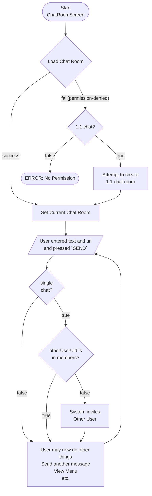
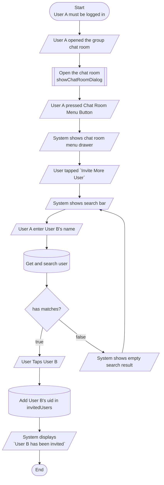

# EasyChat

EasyChat offers everything you need to build a chat app. With the EasyChat package, you can easily add a full-featured, attractive chat function to your existing app.

For your information, EasyChat:

- Uses Firestore for chat room management for efficiency,
- Utilizes Realtime Database for cost-saving measures like managing chat messages and tracking new message counts,
- Supports push notification subscriptions and sending,
- Enables photo sharing, file transfers and URL previews, among others,
- Provides everything needed for chat functionality,
- Comes with a beautiful UI/UX by default,
- Is optimized for use in large-scale chat applications.


## TODO

- Supporting `verifiedUserOnly`, `urlForVerifiedUserOnly`, `uploadForVerifiedUserOnly`.
- Supporting password.
- Supporting gender. To let only female or male join.


## Overview

- User must login to use any of the chat functionalities.

## Install

Add `easychat` into your `pubspec.yaml`

```sh
% flutter pub add easychat
```

## Example

- See `example/lib/main.dart`.


## Initialization

```dart
ChatService.instance.init();
```

## Logic

- User must sign in to use any of the chat features.
  - You must be sure that the user sign in first before using the chat screen. Or an error may appears on the screen.

## User database

`easychat` gets user data from `/mirror-users/<uid>/` node in realtime database. So, your app needs to save your display name and photo url in this node. If your app uses diferent database structure, then simply copy the user's data into `/mirror-users/<uid>/` node.

For your information, `easychat` uses `easyuser` package to manage the user's data. You don't have to install this package as the dependency of yoru app. It's not required but recommended to understand how `easychat` package works.


```dart
ChatService.instance.init();
```

## Chat Database

### Chat room database struture

- `/chat-rooms/{roomId}` is the document of chat room information. Chat room documents are saved in Firestore.

- the `room id` has a triple-hypen(`---`) if it's a 1:1 chat.

- `name` is the name of the chat room.

- `description` is the description of the chat room.

- `users` field is a Map that has user's uid as key. And the value of the user is another Map that has key/value for sorting/listing the chat rooms of each user. See the `chat.room.user.dart` for the details of fields.
  - All chat room users(members) exists in this Map whether it is a 1:1 chat or a group chat.

- `invitedUsers` field has the list of invited user's uid. They cannot enter the chat room, until they confirm it in the app.

- `rejectedUsers` field has the uid list of the rejected users from the invitation. Once the user rejected, his uid is moved from `invitedUsers` to `rejectedUsers`. In this way, the rejected users will not see the invitation in the chat list any more and the inviter cannot invite anymore.

- `blockedUsers` is the uid list of blocked users by masters.

- `masterUsers` is the uid list of master user. See [Masters](#masters)

- `createdAt` is the Firestore Timestamp when the chat room created.

- `updatedAt` is the Timestamp when the chat room information updated.

- `open` if it is set to true, the chat room is open chat. So, it is listed in the open chat rom list and anyone can join the chat room without invitation.

- `hasPassword` is set to true if the chat room has a password. See [Password](#password)

- `single` - is true when the room is single chat

- `group` - is true when the room is group chat

- `open` - is true when the room is open group chat.

- `gender` - If it is 'M', only males can joins the chat room. If it is 'F', only femails can join the chat room (NOT SUPPORTED, YET)

- `domain` - It is the domain of the chat room. It is for a grouping chat rooms. It can be the name of the app.
  - For instance, There are two different apps: A and B. And the two apps are using same Firebase project.
    - And the developer may want to display only the chat rooms that were created by app A in the app A.
  - The domain can be initlized by `init` and will be set to the chat room that are created by the app.
    - And it's upto you how you use it.


### Chat message database structure

- `/chat-messages/<room-id>` is the path of chat room messages. It is saved in Realtime Database.
- 


### Chat room security

- Chat room information must not be public. Only members and invited users, and the rejected users read it.
  - Invite users are included to read the chat room information NOT because once is was invited, but because there is no easy way of displaying the list of chat rooms that the user has rejected.
  - To secure the chat room information from the rejected users, the chat room information should maintain as less information as possible. For this reason, the chat room does not store the last message.
  - So, to display the last chat message on chat room list, the package listens the last message of the chat room.

#### Cost of Firestore

- Firestore is more expensive compared to Realtime Database.
  - In the previous version, we were able to build the complete chat functionality with Realtime Database, but you(developers) don't like it. That's why we converted it to Firestore. Well, it costs more.
  - We have plan to customize on costy parts of Firestore chat rooms, and share the chat room data management with Realtime Database.
  - For now, when theere is a chat message, chat room updates.
    - In chat room list screen and chat room screen, the chat room document are listened(subscribed) for realtime updates. And it will be a bit costy.
    - If you have millions of users and if it costs, let us know. We will hurry to customize it for low cost.

### Chat message database struture (RTDB)

For the speed and cost efficiencies, the chat messages are saved under `/chat-messages/{roomId}` in Realtime Database

- `senderUid` is the chat message sender uid.
- `createdAt` is the date time of the chat message.
- `order` is the chat message list order.
- `text` is the text of the chat message.
- `url` is the url of photo or file of the chat message.
- `deleted` is true when the message is deleted. if the message is deleted, then text, url, url preview values will be deleted.
- When sending a chat message, if the text contains a URL, the site information is displayed for previewing. The appropriate values are stored in the following fields below the message:
  - `previewUrl` - URL
  - `previewTitle` - Title
  - `previewDescription` - Description
  - `previewImageUrl` - Image

### Chat room settings per each users (RTDB)

- Chat room user setting will be saved under `/chat-room/{uid}/{roomId}` in Realtime Database.

- Why is the personal chat room setting required?
  - Users can customize their chat rooms in several ways, such as:
    - Naming their chat rooms.
    - Marking certain chat rooms as favorites.
    - Subscribing to push notifications for updates.
  - Or the chat package saves the number of new messages in each chat room.
  - And much more.


## Group Chat and 1:1 Chat

- `1:1 chat` is also called `single chat`.
- There is only one logic of the chat room and all the chat rooms are considered as a group chat. Even if it's a `1:1 chat`, it is considered as `group chat` and the logic goes same as group chat.

- But why do we need to separate it as a single chat or group chat?
  - When A chats to B, A wants to chat with B alone in 1:1 chat mode. The app will create a chat room meant for A and B alone, which is called single chat.
  - And then, some time later, B wants to chat with A in a 1:1 chat mode. Then, they need to continue the previous chat room.
  - If there is only group chat, it will create the chat room over and over again and they cannot resume the previous chat room.
  - Easy chat uses UIDs of both users to create unique ID for their own private chat room.

## Masters

The one who create chat room automatically becomes a master. And he can add another user as a master.

## Chat invitation

It really happened to one of my own projects that someone sent very bad words to many other users that he does not know. And he ruined the app. So, we have a special feature to prevent this. And this feature is optional.

- Chat invitation is an optional.

  - It can be disabled by default with the option that allows each user to enable it.
  - Or it can be enabled by default with the option that each user to disable it.

- If it is enabled, then the user must accept the invitation to enter the chat room.
  - For instance,
    - A sends a chat message to B for the first time while creating the chat room,
      - then B's uid will be added to `invitedUsers`
        - and a push message should be sent to B.
      - and the chat message is normally saved in the chat room.
    - On B's screen, all the chat room that has B's uid in `invitedUsers` will be displayed on top of the chat list. And B will notice that he is invited.
      - If B accepts the invitation, B's uid will be moved from `invitedUsers` to `users` and normal chat continues.

## Password

NOTE: Password is not supported, yet.

The password must kept in secret by the Security rules. Then, how the user can join the chat room without the help of backend? Here is a solution.

- Since the password must be secured for reading, the password must not be saved in chat room document.
- So, it is saved under `/chat-room/{roomId}/chat-room-meta/private` document.
- And, client cannot read the password and when the user enters the password, how the client can check if the password is correct or not?

The solution is that,

- The user will save the password in `/users/{uid}/user-meta/private {chatRoomPassword: ...}`
- And user tries to join the room and in the security rule,
  - Security rules is the one to check if the password in user meta and in the chat private are the same.
    - If they are the same, then the user can enter the chat room.

This is the way how it can compare the chat password.


## Development Tip

### Opening chat room create in main.dart

```dart
class MyAppState extends State<MyApp> {
  @override
  void initState() {
    SchedulerBinding.instance.addPostFrameCallback((timeStamp) {
      ChatService.instance.showChatRoomEditScreen(globalContext);
    });
    // ...
  }
  // ...
}
```

### Chat to admin

#### 1:1 chat

- If there is only one admin, you can create a 1:1 chat room with the user.

- `chatting to admin` is a simple trick.
  - Simply add `Chat to admin` button in the app, then when the button is being pressed, simply open a chat room with uid of the admin. You can pass the admin uid to `ChatService.instance.showChatRoomScreen(uid: ...)`.

```dart
UserDoc(
  uid: 'h1JVPqCO4mNroGLAklc8AV45XB82',
  builder: (admin) => ListTile(
    title: Text('Inquiry to Admin'.t),
    onTap: () =>
        ChatService.instance.showChatRoomScreen(
      context,
      user: admin,
    ),
  ),
),
```

#### Group chat (NOT SUPPORTED, YET)

This feature is not supported, yet.

- ~~If there are many admins who want to participate in the customer care chat, list all the uid of admins.~~
- ~~then, create a group chat room with the list of admins and the login user.~~

## chatRoomActionButton

You can add extra button on the header in chat room.
The `chatRoomActionButton` contains the chat room information.
and accepts a Function that return a widget.
The return widget will be display in the action button.

Usage: (e.g. adding extra icon on the chat room header)

```dart
    ChatService.instance.init(
      chatRoomActionButton: (room) => IconButton(
        onPressed: () {
          /// do some state
        },
        icon: const Icon(Icons.notifications),
      ),
    );
```

## onSendMessage CallBack

Using `onSendMessage` is a callback after the message is sent.
It contains the `ChatMessage` information and the `ChatRoom` information.

Usage: (e.g. push notification to other users in the chat room)

You may also use `PushNotificationToggleIcon` widget which came from `easy_messaging` package. It display a toggle push notification icon.
and make a subscription to rtdb using the room id as subscriptionName.
The path is `fcm-subscriptions/$subscriptionName/$userId`.
By default `pushNotificationToggleIcon` display enable icon when it is set to true, otherwise false. To reverse this we can set `reverse: true`.
Which display a disable icon when it is set to true, otherwise false.
With this we can exclude Subscribers from push notification.

```dart
    ChatService.instance.init(
      /// push notification toggle icon in reverse
      chatRoomActionButton: (room) => PushNotificationToggleIcon(
        subscriptionName: room.id,
        reverse: true,
      ),
      onSendMessage: (
          {required ChatMessage message, required ChatRoom room}) async {
        /// remove current user uid
        final uids = room.userUids.where((uid) => uid != myUid).toList();
        if (uids.isEmpty) return;
        /// send push notification to remaining uid
        /// using sendMessageToUid along with subscriptionName and
        /// excludeSubscribers set to `true` will exclude the uids if
        /// their subscription to room id is set to true.
        MessagingService.instance.sendMessageToUids(
          uids: uids,
          subscriptionName: room.id,
          excludeSubscribers: true,
          title: '{name} sent you a message'.tr(args: {'name': my.displayName}),
          body: '${message.text}',
          data: {"action": 'chat', 'roomId': room.id},
        );
      },
    );
```

## onInvite Callback

The `onInvite` callback is triggered after a user was invited to the chat room.
This is called from `ChatRoom` -> `inviteUser` method.

Usage: (e.g. push notification to inform the other user of invitation)

```dart
ChatService.instance.init(
      onInvite: ({required ChatRoom room, required String uid}) async {
        MessagingService.instance.sendMessageToUids(
          uids: [uid],
          title: '{name} invited you to join a chat room'.tr(args: {
            'name': my.displayName,
          }),
          body: 'You got chat room invite'.t,
          data: {
            "action": 'chatInvite',
          },
        );
      },
    );
```

## chatRoomNewMessageBuilder

The `ChatNewMessageCounter` is for displaying the number of new message of the whole chat rooms.

If you want to display the number of new messages of each chat room, you can use `chatRoomNewMessageBuilder` builder.

## Chat Room Blocking

User can be blocked in a chat room. This is different from user blocking by a user. This block functionality will make the masters block the chat room member.

When a master blocks a user in chat room, the user will be kicked out of the chat room. The user will not be able to re-join the chat room.

This is only applicable to group chats, for open or not open, since the user can block another user directly.

### Chat Room Blocking Security Rule

The room doc should be allowed to be read even if the user is blocked, because it may cause permission problem if the blocked user will be querying for other open group chats. There is no such thing as "array-not-contains" in firestore query.

However, we should not allow blocked user to put himself in members (or chat room user) and it should be in security rule.

What we can also do is to filter out the room docs that blocked the user in Room List view.

For non-open group chat, querying is not an issue since we query chat rooms that the user is a member of, and since blocking user will kick out the user as well.

### Group Chats with blocked users

User can be blocked as itself or blocked in a chat room.

When user blocks other user (the account itself), the rooms should cover/hide the chat messages of the blocked user.

## Chat Room Logic Diagrams

### Logic for Creating Group Chat


### Logic for Creating/Opening Single Chat


### Logic for Opening Chat Room

- `ChatService.instance.showChatRoomScreen` can open `ChatRoomScreen`.
  - You may call `ChatRoomScreen` directly from your app.




### Logic for Inviting User in Group Chat

User A wants to invite User B in a group chat.



### Process for Accepting/Rejecting Chat Request/Invitation

User B wants to accept an invitation.


### Logic for Blocking User in Group Chat

