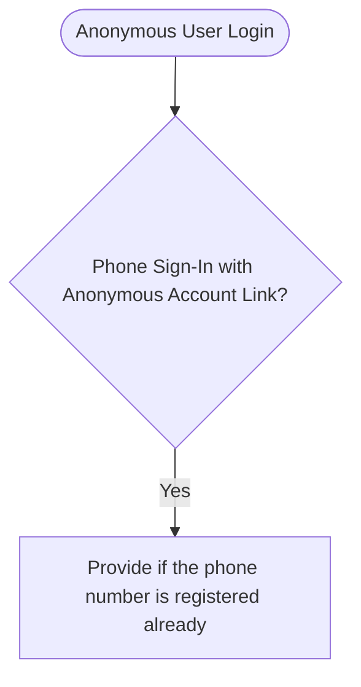

# Easy User

- User management package based on Firebase Realtime Database.

# Database Structure

- `users`: is the root node of the database.
  - `users/<uid>`: is the user node.
    - `users/<uid>/name`: is the name of the user.
    - `users/<uid>/photoUrl`: is the photo url of the user.
    - `users/<uid>/role`: is the role of the user.
    - `users/<uid>/status`: is the status of the user.
    - `users/<uid>/createdAt`: is the created date of the user.
    - `users/<uid>/updatedAt`: is the updated date of the user.
    - `users/<uid>/deletedAt`: is the deleted date of the user.
    - `users/<uid>/deleted`: is the deleted status of the user.
    - `users/<uid>/password`: is the password of the user.
    - `users/<uid>/phone`: is the phone of the user.
    - `users/<uid>/address`: is the address of the user.
    - `users/<uid>/gender`: is the

- `users-private`: is the root node of the database.
  - `users-private/<uid>`: is the user node.
    - `users-private/<uid>/email`: is the email of the user.
    - `users-private/<uid>/phoneNumber`: is the phone number of the user.

# Widgets

## UserField

This wdigets gets only one field of user data and displays.

- `field`: Required. It is to get the minium data of the user field.

- `uid`: is the user id to display.

- `onLoading`: is the loading state of the widget.

- `onError`: is the error state of the widget.

- `builder`: is the builder function to build the widget.

- `sync`: is the sync option. if it's true, it will rebuild the widget when the user data is updated.

- `initialData`: is the initial data that is used on very first time. The data may be cached. If the data is not cached, then it will be used as initial data.

- `cache`: is the cache option. If it's true, then it will use cached data only. If there is no cached data, then it will get data from the server.

## UserModel

This wdiget passes the User model object on the builder method. Meaning, this widget can display all the user data.

- `uid`: is the user id to display.
- `onLoading`: is the loading state of the widget.
- `builder`: is the builder function to build the widget.
- `sync`: is the sync option. if it's true, it will rebuild the widget when the user data is updated.

- `initialData`: is the initial data that is used on very first time. The data may be cached. If the data is not cached, then it will be used as initial data.

- `cache`: is the cache option. If it's true, then it will use cached data only. If there is no cached data, then it will get data from the server.

# Logics

## Account Linking

- `/registered-phone-number`: is the node to check if the phone number is registered.
  - Why?
    - To link the phone number to the existing user account.
    - User may sign-in with other sign-in methods like Anonymous, Email, Google, Apple, Facebook, or etc.
    - If the phone number is already registered (or signed-in before), it means, the phone number belongs to an account.
      - You cannot link the phone number to another account when it is already linked to an account.
    - Once the credential of phone number is used, it cannot be used again. (The credential may be reused on other methods.)
    - You may try to link the phone number credential and if it's successful, well, then it's linked.
      - But what if it fails? you cannot reuse the credential. It means, the user must get new credential by sen

